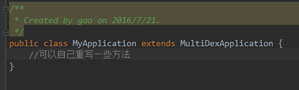
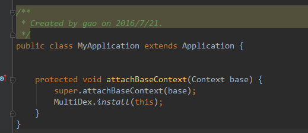
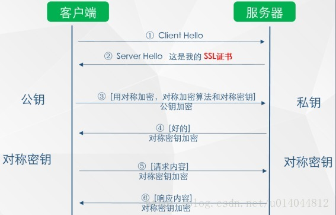
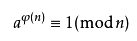
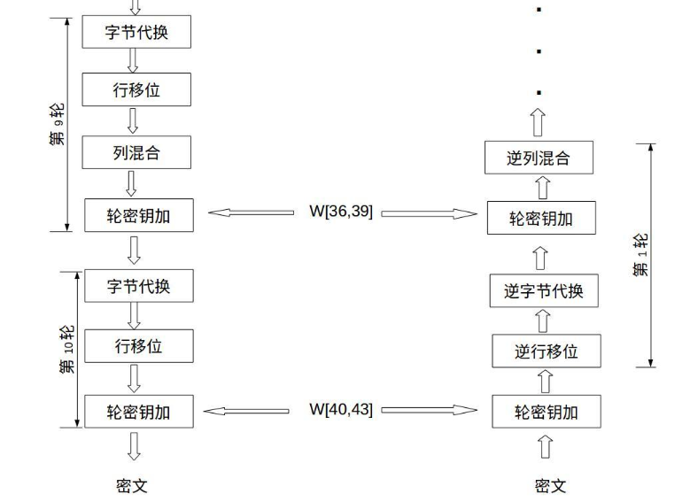

# Android 基础回顾总结 #
---------------1.0.0/2018.10.29

[TOC]


## Activity生命周期 ##


### 1. 常用生命周期 ###

    
   

- onCreate 
表示activity正在创建。这个方法中可以做一些初始化操作（setContentView加载布局，初始化数据等），但是不能太耗时。否则造成体验影响，或anr
- onStart
activity正在被启动，初始化完成，但是还在后头我们看不见。
- onRestart
    当activity有onStop的不可见状态，到可见时，则被调用。
- onResume 
已经可见在前台了。
- onPause
 一般当前页面被遮挡了（但是没有完全遮挡），则会回调此周期
- onStop
    当前界面被完全遮挡时，
- onDestroy
    界面被正常销毁
- onNewIntent
    一般和设计模式有关， singalTask ，singalTop
- onSaveInstanceState
    非正常关闭时，则会调用此状态
- onRestoreInstanceState
    非正常关闭后，再重新调创建时，则会调用此状态。

    > 生命周期可以做一些初始化（onCreate、onStart、onResume）和资源释放（onPause、onStop、onDestroy）的操作。但是都不能做太耗时的操作，否则会影响体验（界面的显示卡顿，或影响下一个页面的加载）。


### 2. 不同情况下的生命周期 ###

- 场景1： ActivityA 跳转到ActivityB， 然后ActivityB按Back键返回到ActivityA
  
    - ActivityA 跳转到ActivityB:
       A-onPause->B-onCreate->B-onStart->B-onResume->A-onSaveInstanceState->A-onStop
    - ActivityB 返回到 AcitivityA
    B-onPause->A-onRestart->A-onStart->A-onResume->B-onStop->B-onDestroy

- 场景:2： ActivityA 跳转到ActivityB (startActivityForResult)， 然后ActivityB setResult并finish返回到ActivityA
   - ActivityA 跳转到ActivityB:
       A-onPause->B-onCreate->B-onStart->B-onResume->A-onSaveInstanceState->A-onStop
   - ActivityB 返回到 AcitivityA
    B-onPause->A-onActivityResult->A-onRestart->A-onStart->A-onResume->B-onStop->B-onDestroy
- 场景3：ActivityA ->（跳转）ActivityB ->(跳转)ActivityA, A 启动模式为signalTask
    - ActivityA 跳转到ActivityB:
       A-onPause->B-onCreate->B-onStart->B-onResume->A-onSaveInstanceState->A-onStop
    - ActivityB 跳转到 AcitivityA
    B-onPause->A->onNewIntent->A-onRestart->A-onStart->A-onResume->B-onStop->B-onDestroy

- 场景4：ActivityA ->（跳转startActivityForResult ）ActivityB ->(跳转)ActivityA, A 启动模式为singleTask
    - ActivityA 跳转到ActivityB:
       A-onPause->B-onCreate->B-onStart->B-onResume->A-onSaveInstanceState->A-onStop
    - ActivityB 跳转到 AcitivityA
    B-onPause->A-onActivityResult->A->onNewIntent->A-onRestart->A-onStart->A-onResume->B-onStop->B-onDestroy
- 场景5：ActivityA ->（跳转）ActivityA , A 启动模式为singleTop
 - ActivityA 跳转到ActivityA:
   A-onPause->A->onNewIntent->A-onResume

##启动模式（LaunchMode） ##

### 1. 启动模式种类 ###
- standard
标准模式。
- singleTop
当activity栈的顶部是要启动的Activity 的实例，并且是当前模式，则不会重新创建新的activity，而是使用当前的activity。（场景，一些当前页面反复天跳转到当前页面的场景，如个人主页什么的）
- singleTask
当某个页面又要启动ActivityA时，如果栈中有ActivityA，并且模式是singleTask ，则会把ACtivityA之上的Activity清理出站，让ActivityA显示在栈顶。
- singleInstance
单独创建一个新栈维护当前的activity

### 2. 查看activity栈 ###

adb shell dumpsys activity activities 可以用来查看Activity Task栈的情况

### 3. singleInstance模式 ###

- ActivityA（standard）
- ActivityB (instance)
- ActivityC (SingleTop)


首先ActivityA 创建在栈A中, 接着 ActivityB 在新栈B中（B栈为当前栈）， 启动ActivityC 则又重新进入了栈A中（栈A为当前栈）。

此时点击back键，则是ActivityC 从A栈中出栈， 然后是ActivityC从栈A中出站，然后再是ActivityB从栈B中出栈。


## Activity 与Fragment 的onActivityResult 启动于回调传播 ##

#### 1. activity使用 onActivityResult ####
启动activity的时候使用startActivityForResult（intent，requestCode）；

#### 2. fragment 使用onActivityResult ####

- activty中单层Fragment情况。
    - 使用app包下面的Fragment。
        fragment 收到结果条件： 需要调用fragment中的startActivityForResult（intent，requestCode），而不是调用Activity 中的startActivityForResult。
        
        结果： fragment 中的onActivityForResult有回调，而 Activity中onActivityForResult无回调。
    
    - 使用support4 包中的Fragment 
        fragment 收到结果条件：  1）需要调用fragment中的startActivityForResult（intent，requestCode）2） Activity 中的onActivityForResult方法中必须调用super.onActivityForResult()，如果没有则只有Activity中有回调。
      
        结果： fragment 中的onActivityForResult有回调，Activity中onActivityForResult有回调，但是activity 中回调则requestCode 不正确。
    
    - 28 api 开始弃用了app包中的Fragment
- 多层Fragment 回掉，则需要主动的去通过Fragment调用onActivityForResult。

#### 3. 启动模式与onActivityResult ####

- ActivityA（包含FragmentA ），Fragment 中调用getActivity(). startActivityForResult（intent，requestCode）. ActivityB 启动模式为SignalTask， 则的onActivityResult 无回调。 
Fragment 中调用startActivityForResult 效果是一样的。
> 注意： ActivityA在点击按钮一跳转就会onActivityResult直接回掉，而不是等待在ActivityB返回后，再回调。

- 当ActivityA 启动模式为singleInstance  时，onActivity 也是无效的。 
>ActivityA在点击按钮一跳转就会onActivityResult直接回掉，而不是等待在ActivityB返回后，再回调（和上面一样）。


## Service ##

### 1.Service启动方式 ###
- startService
  通过其他组件启动service，可以独立在后台无限运行（版本不会回收，个别手机除外（小米，华为等））。需要自己调用stopSelf去停止，停止后然后被系统销毁。
- bindService
  依附于activity。当activity销毁之后，其也会自动停止，并销毁。bindService一般用于和Service进行数据交互。
两种方式可以混合使用。

### 2.生命周期 ###
   
### 3.Service通信 ###
- intent  
  轻量级数据传给Service 则可以使用startService。把数据放在intent 中，传给Service。 
  在Service 的 onStartCommand中处理信息。  
- Messager 
    底层实现是AIDL。是对AIDL实现的封装。
    使用方法是，
    - 在Service里，通过Messager（MessagerHandler）创建Messager 对象，然后通过       messager.getBinder() 方法，在onBinder 方法中返回Binder。MessagerHandler 是用于接收处理对象的。
    - 在client端： 在用于绑定Service的Connection 对象实现中的 onServiceConnected（ComponentName name， IBinder binder）中，通过取得binder对象，使用Messager的
    Messager（IBinder） 方法构造出Messager对象。然后就可以通过Messager对象send msg给Service了。消息会传到Service中的Messager的MessagerHandler 中的handlerMessage方法中处理。
    - 实现Service 向client 通信时，需要在client端通过Messager（MessagerHandler），然后把这个对象通过 有service传过来IBinder生存的Messager传到Service端，然后Service端就拥有了client端Messager 通道对象，通过send就可以向client传输信息了。    
    

- AIDL
	- 语法 
	没有修饰词， 参数有in out方向
	- AIDL声称的源码，看一下；stub 等 等 


### 4.IntentService ###
IntentService 是用来做异步任务处理的。主要用于耗时操作。

- 继承了Service的抽象类。需实现onHandleIntent方法。
- 内部实现主要是在onCreate 中实现了HandlerThread 和 ServiceHandler。ServiceHandler 是集成实现的Handler。 原理就是创建了一个持有子线程Looper的handler。
- stratService来进行任务启动和添加。具体是在onStart 和 onStartCommand中把任务传给Handler进行处理。 在handler 的handleMessage方法中调用了onHandleIntent。
- 任务处理结束则会调用stopSelf（id）来检测是否要结束服务。id的作用用于检测，是否还有任务是否完成。只有id于启动id一样才会停止Service。


## 动画##
### 1.Tween动画 ###
用xml编写动画，用AnimationUtils加载动画
```xml
<?xml version="1.0" encoding="utf-8"?>
<set xmlns:android="http://schemas.android.com/apk/res/android"
    android:shareInterpolator="true">

    <rotate android:fromDegrees="0"
            android:toDegrees="359"
            android:duration="1000"
            android:repeatCount="1"
            android:repeatMode="reverse"
            android:pivotX="50%"
            android:pivotY="50%"/>
</set>

```
```java
LinearLayout layout = (LinearLayout)findViewById(R.id.layout_1);
Animation animation = AnimationUtils.loadAnimation(this, R.anim.tween_1);
layout.startAnimation(animation);

```
只能写移动、缩放、旋转、渐变四种动画，以及这四种动画的组合，不支持自定义View的拓展。其次一个致命的缺点就是动画只是屏幕绘制上的动画，控件的属性并没有改变，一个经典的问题就是一个Button从一个地方移动到另一个地方，点击事件还是在原来的地方。

### 2.属性动画###
属性动画是Android3.0版本推出的动画框架，其功能和拓展性都很强。它不仅能实现所有Tween动画的功能，还有很强的拓展性，根本原因是属性动画从本质上已经完全摆脱了控件，虽然我们大多数情况下使用属性动画都是给控件做动画，但是属性动画的底层只是一个数值发生器，和控件没有半毛钱关系。

- ValueAnimator 数值触发器
    ValueAnimator的功能就是在两个数值范围内，顺序地产生过渡数值，过渡速率可以通过Intepolator来控制，过渡时间通过duration来设置，最终产生一组有特定变化速率的数值序列。
    - 示例1：
    ```java
        // 图片反转
        ValueAnimator animator = ValueAnimator.ofFloat(0, 360);
        animator.setDuration(1000);
        animator.setInterpolator(new AccelerateInterpolator());
        animator.setRepeatCount(1);
        animator.setRepeatMode(ValueAnimator.REVERSE);
        animator.addUpdateListener(new ValueAnimator.AnimatorUpdateListener() {
            @Override
            public void onAnimationUpdate(ValueAnimator valueAnimator) {
                float value = (float)valueAnimator.getAnimatedValue();
                imageView.setRotationY(rotate);
            }
         });
        animator.start();
    ```
    - 示例2：
    ```java
        // 数值递增
        ValueAnimator animator = ValueAnimator.ofFloat(0, 2000);
        animator.setDuration(1000);
        animator.addUpdateListener(new ValueAnimator.AnimatorUpdateListener() {
            @Override
            public void onAnimationUpdate(ValueAnimator valueAnimator) {
                float value = (float)valueAnimator.getAnimatedValue();
                textView.setText(String.valueOf(value));
            }
         });
        animator.start();
    ```
- ObjectAnimator
ObjectAnimator把ValueAnimator封装在里面，我们用它可以简单地实现对控件的动画。
    - 示例1：
    ```java
    // 同上，图片反转
    ObjectAnimator animator = ObjectAnimator.ofFloat(imageView, "rotationY", 0, 359);
    animator.setDuration(1000);
    animator.setRepeatCount(1);
    animator.setRepeatMode(ValueAnimator.REVERSE);
    animator.start();
    ```
    第一行代码有三个参数，分别是做动画的控件, 需要动画的属性名，第三个是可变参数，表示动画值的范围。其中属性名是一个字符串，ObjectAnimator会根据这个属性名拼一个set[属性名]（setRotationY）方法，然后用反射调用，从而实现动画。
    - 示例2： 自定义View 
    ```java
    //扇形动画
    ObjectAnimator animator = ObjectAnimator.ofFloat(customView, "fraction", 0, 1);
    animator.setDuration(2000);
    animator.start();
    ```
    扇形的角度由一个叫fraction的属性决定。我们在自定View中需要做动画的属性一定要有一个setFraction方法，以便让属性动画通过反射调用。
    
    - 示例3：path 动画
    
    ```java
         ObjectAnimator animator = ObjectAnimator.ofFloat(iv, View.X, View.Y, path);
        animator.setDuration(2000);
        animator.setRepeatCount(1);
        animator.setRepeatMode(ValueAnimator.REVERSE);
        animator.start();
    ```
    - Interpolator 插值器
    
        Interpolator翻译叫插值器，它用来控制动画过程的变化速率。Android中Interpolator总共有8种。

        - Linear
        - Accelerate
        - Decelerate
        - AccelerateDecelerate
        - Anticipate
        - Overshoot
        - Bounce
        - Cycle 


### 3.帧动画 ###
帧动画是一个比较简单的动画框架，原理就像播放幻灯片一样，传一组图片进去，然后依次循环播放，可以设置每一张图片的播放时间。帧动画可以通过xml创建，也可以java代码动态构建

示例 AnimationDrawable 
```java
    <?xml version="1.0" encoding="utf-8"?>
    <animation-list xmlns:android="http://schemas.android.com/apk/res/android"
                    android:oneshot="false">
        <item android:drawable="@mipmap/run_1" android:duration="150" />
        <item android:drawable="@mipmap/run_2" android:duration="150" />
        <item android:drawable="@mipmap/run_3" android:duration="150" />
        <item android:drawable="@mipmap/run_4" android:duration="150" />
    </animation-list>

    ImageView image = (ImageView) findViewById(R.id.iv_1);
    image.setImageResource(R.drawable.animation_list);
    AnimationDrawable anim = (AnimationDrawable) image.getDrawable();
    anim.start();
```
动画不连续。可增多图片增加连续性，但是体积太大。

- CircularReveral （ViewAnimationUtils）
Android5.0推出的新的动画框架，可以给View做一个揭露效果。
示例：
```java
    Animator anim = ViewAnimationUtils.createCircularReveal(oval, oval.getWidth() / 2,
        oval.getHeight() / 2, oval.getWidth(), 0);
    anim.setDuration(2000);
    anim.start();

    Animator anim = ViewAnimationUtils.createCircularReveal(rect, 0, 0, 0, 
        (float) Math.hypot(rect.getWidth(), rect.getHeight()));
    animator2.setDuration(2000);
    animator2.start();
```

### Activity转场动画 ###
- 传统转场动画

    ```java
    <?xml version="1.0" encoding="utf-8"?>
    <set xmlns:android="http://schemas.android.com/apk/res/android">
        <translate android:fromXDelta="100%"
                   android:toXDelta="0%"
                   android:duration="500" />
    </set>
    
    <?xml version="1.0" encoding="utf-8"?>
    <set xmlns:android="http://schemas.android.com/apk/res/android">
        <translate android:fromXDelta="0%"
                   android:toXDelta="-40%"
                   android:duration="500" />
    </set>
    
    startActivity(new Intent(this, Activity2.class));
    overridePendingTransition(R.anim.slide_right_in, R.anim.slide_left_out);
    ```
- 5.0新转场动画
5.0新的转场动画分为4种，Explode、Slide、Fade、Share，传统的转场动画只能作用于整个页面，不能对页面中的单个元素做控制，而5.0新转场动画可以控制页面中的每个元素，根据元素动画方式，分为4大类。
    - Explode
        Explode的效果是下一个页面的元素从四面八方进入，最终形成完整的页面。
        ```java
        Intent intent = new Intent(this, CActivity.class);
        startActivity(intent, ActivityOptions.makeSceneTransitionAnimation(this).toBundle());
        
        // 跳转的Activity
        public class CActivity extends AppCompatActivity {
        
            @Override
            protected void onCreate(@Nullable Bundle savedInstanceState) {
                super.onCreate(savedInstanceState);
                getWindow().setEnterTransition(new Explode());
                setContentView(R.layout.activity_c);
            }
        }

        ```
    调用getWindow().setEnterTransition(new Explode()); 注意要在setContentView之前
    - Slide
    Slide就是下一个页面元素从底部依次向上运动，最终形成完整的页面。
    ```java
        Intent intent = new Intent(this, CActivity.class);
        startActivity(intent, ActivityOptions.makeSceneTransitionAnimation(this).toBundle());
        
        // 跳转的Activity
        public class CActivity extends AppCompatActivity {
        
            @Override
            protected void onCreate(@Nullable Bundle savedInstanceState) {
                super.onCreate(savedInstanceState);
                getWindow().setEnterTransition(new Slide());
                setContentView(R.layout.activity_c);
            }
        }
    ```
    - Fade
    Fade就是下一个页面元素渐变出现，最终形成完整的页面

    ```java
        Intent intent = new Intent(this, CActivity.class);
        startActivity(intent, ActivityOptions.makeSceneTransitionAnimation(this).toBundle());
        
        // 跳转的Activity
        public class CActivity extends AppCompatActivity {
        
            @Override
            protected void onCreate(@Nullable Bundle savedInstanceState) {
                super.onCreate(savedInstanceState);
                getWindow().setEnterTransition(new Fade());
                getWindow().setExitTransition(new Fade());
                setContentView(R.layout.activity_c);
            }
        }
    ```

    要同时设置Enter和Exit。

    - Share
    Share是最复杂的一种转场方式，在跳转的两个Activity之间，如果有相同的View元素，那么，两个元素就可以设置成共享状态，在跳转时，这个View就会从第一个Activity的显示状态过渡到第二个Activity的显示状态，给用户的感觉仿佛是两个Activity共享一个View。
    
    ```java
        <!-- 首先，两个Activity共享的元素需要设置相同的transitionName： android:transitionName="fab" -->
        <Button
             android:id="@+id/fab_button"
             android:layout_width="56dp"
             android:layout_height="56dp"
             android:background="@mipmap/ic_launcher"
             android:elevation="5dp"
             android:onClick="explode"
             android:transitionName="fab" />
        
        <Button
             android:id="@+id/fab_button"
             android:layout_width="160dp"
             android:layout_height="160dp"
             android:layout_alignParentEnd="true"
             android:layout_below="@id/holder_view"
             android:layout_marginTop="-80dp"
             android:background="@mipmap/ic_launcher"
             android:elevation="5dp"
             android:transitionName="fab" />

        // 跳转时，要为每一个共享的view设置对应的transitionName
        View fab = findViewById(R.id.fab_button);
        View txName = findViewById(R.id.tx_user_name);
        intent = new Intent(this, CActivity.class);
        startActivity(intent, ActivityOptions.makeSceneTransitionAnimation(this,
                Pair.create(view, "share"),
                Pair.create(fab, "fab"),
                Pair.create(txName, "user_name"))
                .toBundle());

        // 跳转的Activity在onCreate方法中开启Transition模式
        public class CActivity extends AppCompatActivity {
        
            @Override
            protected void onCreate(@Nullable Bundle savedInstanceState) {
                super.onCreate(savedInstanceState);
                getWindow().requestFeature(Window.FEATURE_CONTENT_TRANSITIONS);
                setContentView(R.layout.activity_c);
            }
        }

    ```    

### 矢量动画 ###

- 爱心矢量图
    ```java
    <?xml version="1.0" encoding="utf-8"?>
    <vector xmlns:android="http://schemas.android.com/apk/res/android"
            android:width="256dp"
            android:height="256dp"
            android:viewportHeight="32"
            android:viewportWidth="32">
    
        <path
            android:fillColor="#e11c00"
            android:pathData="M20.5,9.5 c-1.955,0,-3.83,1.268,-4.5,3
                            c-0.67,-1.732,-2.547,-3,-4.5,-3 C8.957,9.5,7,11.432,7,14
                            c0,3.53,3.793,6.257,9,11.5 c5.207,-5.242,9,-7.97,9,-11.5
                            C25,11.432,23.043,9.5,20.5,9.5z" />
    </vector>
    
    ```
    根节点是vector，width和height属性是显示大小，但是实际上这个大小是可以根据控件改变的。viewportHeight和viewportWidth也是宽高，它是定义曲线函数时所参照的宽高。子节点path就是定义绘制内容的，fillColor是填充颜色，pathData是描绘路径。

- SVG
    SVG语法最基础的命令。
    M：新建起点，参数x，y（M20， 30）
    L：连接直线，参数x，y（L30， 20）
    H：纵坐标不变，横向连线，参数x（H20）
    V：横坐标不变，纵向连线，参数y（V30）
    Q：二次贝塞尔曲线，参数x1，y1，x2，y2（Q10，20，30，40）
    C：三次贝塞尔曲线，参数x1，y1，x2，y2，x3，y3（C10，20，30，40，50， 60）
    Z：连接首尾，闭合曲线，无参数

    掌握以上这些基本命令之后，我们基本上就可以画出90%的图形了。比如上面demo只用到了三个命令：M、C、Z，我们整个系列所有demo用到的命令也就只有M、L、C、Z。
- animated-vector 让矢量图动起来
   示例：三横杠旋转360度变箭头
    - layout文件，一个普通的ImageView，src指向一个drawable
    ```java
        <ImageView
            android:id="@+id/imgBtn"
            android:layout_width="200dp"
            android:layout_height="200dp"
            android:onClick="startAnim"
            android:src="@drawable/animvectordrawable" />
    ```
    - drawable

    drawable根节点是一个animated-vector，drawable参数用于指定初始显示的样子，下面两个target子节点用于指定动画，第一个target是指定了旋转动画，第二个target指定了path转变动画。下面我们分别来看下初始的drawable和两个target。

    ```java
        <!-- animvectordrawable.xml -->
        <animated-vector xmlns:android="http://schemas.android.com/apk/res/android"
            android:drawable="@drawable/vectordrawable" >
            <target
                android:name="rotationGroup"
                android:animation="@anim/rotation" />
        
            <target
                android:name="v"
                android:animation="@anim/path_morph" />
        </animated-vector>
    ```
    - 初始化drawable 绘制矢量图
    
        ```java
            <vector xmlns:android="http://schemas.android.com/apk/res/android"
            android:height="300dp"
            android:width="300dp"
            android:viewportHeight="70"
            android:viewportWidth="70" >
        
            <group
                android:name="rotationGroup"
                android:pivotX="35"
                android:pivotY="35"
                android:rotation="0.0" >
                <path
                    android:name="v"
                    android:fillColor="#000000"
                    android:pathData="M10,10 L60,10 L60,20 L10,20 Z M10,30 L60,30 
                        L60,40 L10,40 Z M10,50 L60,50 L60,60 L10,60 Z" />
            </group>
        </vector>
        ```
        **注意：**animated-vector规定，可以有多个动画同时进行，但是一个对象上只能加载一个动画。上面的例子可以看到三条线图形转变成箭头图形，同时旋转360度，那就要有两个动画，一个做path变换，一个做旋转。但是两个动画不能同时放在一个对象上，所以必须用group包一层，把path变换动画放在path对象上，把旋转动画放在group对象上，从而实现整体的效果。
    - target1
        属性动画。作用于group 上的rotation属性。
        ```java
            <!-- rotation.xml -->
            <objectAnimator
                xmlns:android="http://schemas.android.com/apk/res/android"
                android:duration="1500"
                android:propertyName="rotation"
                android:valueFrom="0"
                android:valueTo="360" />
        ```
    - target2
    ```java
        <!-- path_morph.xml -->
        <set xmlns:android="http://schemas.android.com/apk/res/android">
            <objectAnimator
                android:duration="1500"
                android:propertyName="pathData"
                android:valueFrom="M10,10 L60,10 L60,20 L10,20 Z M10,30 L60,30 L60,40 
                    L10,40 Z M10,50 L60,50 L60,60 L10,60 Z"
                android:valueTo="M5,35 L40,0 L47.072,7.072 L12.072,42.072 Z M10,30 L60,30 L60,40 
                    L10,40 Z M12.072,27.928 L47.072,62.928 L40,70 L5,35 Z"
                android:valueType="pathType" />
        </set>
    ```
    作用于path的pathdata属性。
    valueFrom和valueTo分别指定了变换前的path和变换后的path，它要求前后两个path必须是同形path
    （PS：如果两个path拥有相同的命令数，并且对应位置的命令符相同，那么这两个path我们称之为同形path。
    如：
    M10,15 L20,20 L25,15 C10,20,20,20,30,10 L50,50 Z
    M20,30 L10,10 L15,25 C25,10,30,30,10,20 L35,35 Z
    ）

  - 启动动画
   
    ```java
        @RequiresApi(api = Build.VERSION_CODES.LOLLIPOP)
        public void startAnim(View view) {
            Drawable drawable = imgBtn.getDrawable();
            ((Animatable) drawable).start();
        }

    ```


- 矢量选择器
    animated-selector用于两个path之间来回切换显示。

    示例：
    - Layout
    Layout，一个普通的 ImageView，src指向一个 drawable
    ```java
        <ImageView
        android:id="@+id/iv_2"
        android:layout_width="wrap_content"
        android:layout_height="wrap_content"
        android:scaleType="fitCenter"
        android:src="@drawable/heart_twitter" />

    ```
    - drawbale
    是一个animated-selector，子节点是两个item和两个transition。
    ```java
        <?xml version="1.0" encoding="utf-8"?>
        <animated-selector
            xmlns:android="http://schemas.android.com/apk/res/android">
        
            <item android:id="@+id/state_on"
                android:drawable="@drawable/ic_twitter"
                android:state_checked="true"/>
        
            <item android:id="@+id/state_off"
                android:drawable="@drawable/ic_heart" />
        
            <transition
                android:fromId="@id/state_off"
                android:toId="@id/state_on"
                android:drawable="@drawable/avd_heart_to_twitter" />
        
            <transition
                android:fromId="@id/state_on"
                android:toId="@id/state_off"
                android:drawable="@drawable/avd_twitter_to_heart" />
        </animated-selector>
    ```
    两个item分别指定了两种状态下要显示的样子，两个transition分别指定了当状态切换时所做的动画。

  - 两个item
  
    ```java
        <?xml version="1.0" encoding="UTF-8"?>
        <vector xmlns:android="http://schemas.android.com/apk/res/android"
                android:width="150dp"
                android:height="150dp"
                android:viewportHeight="24.0"
                android:viewportWidth="24.0">
        
            <group
                android:name="groupTwitter"
                android:pivotX="12"
                android:pivotY="12">
        
                <path
                    android:name="twitter"
                    android:fillColor="#C2185B"
                    android:pathData="M 22.46,6.0 l 0.0,0.0 C 21.69,6.35,20.86,6.58,20.0,6.69 
                    C 20.88,6.16,21.56,5.32,21.88,4.31 c 0.0,0.0,0.0,0.0,0.0,0.0 
                    C 21.05,4.81,20.13,5.16,19.16,5.36 C 18.37,4.5,17.26,4.0,16.0,4.0 
                    c 0.0,0.0,0.0,0.0,0.0,0.0 L 16.0,4.0 C 13.65,4.0,11.73,5.92,11.73,8.29 
                    C 11.73,8.63,11.77,8.96,11.84,9.27 C 8.28,9.09,5.11,7.38,3.0,4.79 
                    C 2.63,5.42,2.42,6.16,2.42,6.94 C 2.42,8.43,3.17,9.75,4.33,10.5 
                    C 3.62,10.5,2.96,10.3,2.38,10.0 C 2.38,10.0,2.38,10.0,2.38,10.03 
                    C 2.38,12.11,3.86,13.85,5.82,14.24 C 5.46,14.34,5.08,14.39,4.69,14.39 
                    C 4.42,14.39,4.15,14.36,3.89,14.31 C 4.43,16.0,6.0,17.26,7.89,17.29 
                    C 6.43,18.45,4.58,19.13,2.56,19.13 C 2.22,19.13,1.88,19.11,1.54,19.07 
                    C 3.44,20.29,5.7,21.0,8.12,21.0 C 16.0,21.0,20.33,14.46,20.33,8.79 
                    C 20.33,8.6,20.33,8.42,20.32,8.23 C 21.16,7.63,21.88,6.87,22.46,6.0 L 22.46,6.0"/>
            </group>
        </vector>
    
        <?xml version="1.0" encoding="UTF-8"?>
        <vector xmlns:android="http://schemas.android.com/apk/res/android"
                android:width="150dp"
                android:height="150dp"
                android:viewportHeight="24.0"
                android:viewportWidth="24.0" >
        
            <group
                android:name="groupHeart"
                android:pivotX="12"
                android:pivotY="12">
        
                <path
                    android:name="heart"
                    android:fillColor="#C2185B"
                    android:pathData="M 12.0,21.35 l -1.45,-1.32 C 5.4,15.36,2.0,12.28,2.0,8.5 
                    C 2.0,5.42,4.42,3.0,7.5,3.0 c 1.74,0.0,3.41,0.81,4.5,2.09 
                    C 13.09,3.81,14.76,3.0,16.5,3.0 C 19.58,3.0,22.0,5.42,22.0,8.5 
                    c 0.0,3.78,-3.4,6.86,-8.55,11.54 L 12.0,21.35 C 12.0,21.35,12.0,21.35,12.0,21.35 
                    C 12.0,21.35,12.0,21.35,12.0,21.35 C 12.0,21.35,12.0,21.35,12.0,21.35 
                    C 12.0,21.35,12.0,21.35,12.0,21.35 C 12.0,21.35,12.0,21.35,12.0,21.35 
                    C 12.0,21.35,12.0,21.35,12.0,21.35 C 12.0,21.35,12.0,21.35,12.0,21.35 
                    C 12.0,21.35,12.0,21.35,12.0,21.35 C 12.0,21.35,12.0,21.35,12.0,21.35 
                    C 12.0,21.35,12.0,21.35,12.0,21.35 C 12.0,21.35,12.0,21.35,12.0,21.35 
                    C 12.0,21.35,12.0,21.35,12.0,21.35 C 12.0,21.35,12.0,21.35,12.0,21.35 
                    C 12.0,21.35,12.0,21.35,12.0,21.35 C 12.0,21.35,12.0,21.35,12.0,21.35 
                    C 12.0,21.35,12.0,21.35,12.0,21.35 C 12.0,21.35,12.0,21.35,12.0,21.35 L 12.0,21.35"/>
            </group>
        </vector>

    ```
  - 两个transition
  
    ```java

        <?xml version="1.0" encoding="utf-8"?>
        <animated-vector
            xmlns:android="http://schemas.android.com/apk/res/android"
            xmlns:aapt="http://schemas.android.com/aapt"
            android:drawable="@drawable/ic_heart">
        
            <target android:name="groupHeart">
                <aapt:attr name="android:animation">
                    <objectAnimator
                        android:propertyName="rotation"
                        android:valueFrom="-360"
                        android:valueTo="0"
                        android:duration="1000" />
                </aapt:attr>
            </target>
        
            <target android:name="heart">
                <aapt:attr name="android:animation">
                    <objectAnimator
                        android:duration="1000"
                        android:propertyName="pathData"
                        android:valueFrom="M 12.0,21.35 l -1.45,-1.32 C 5.4,15.36,2.0,12.28,2.0,8.5 
                        C 2.0,5.42,4.42,3.0,7.5,3.0 
                        c 1.74,0.0,3.41,0.81,4.5,2.09 C 13.09,3.81,14.76,3.0,16.5,3.0 
                        C 19.58,3.0,22.0,5.42,22.0,8.5 c 0.0,3.78,-3.4,6.86,-8.55,11.54 L 12.0,21.35 
                        C 12.0,21.35,12.0,21.35,12.0,21.35 C 12.0,21.35,12.0,21.35,12.0,21.35 
                        C 12.0,21.35,12.0,21.35,12.0,21.35 C 12.0,21.35,12.0,21.35,12.0,21.35 
                        C 12.0,21.35,12.0,21.35,12.0,21.35 C 12.0,21.35,12.0,21.35,12.0,21.35 
                        C 12.0,21.35,12.0,21.35,12.0,21.35 C 12.0,21.35,12.0,21.35,12.0,21.35 
                        C 12.0,21.35,12.0,21.35,12.0,21.35 C 12.0,21.35,12.0,21.35,12.0,21.35 
                        C 12.0,21.35,12.0,21.35,12.0,21.35 C 12.0,21.35,12.0,21.35,12.0,21.35 
                        C 12.0,21.35,12.0,21.35,12.0,21.35 C 12.0,21.35,12.0,21.35,12.0,21.35 
                        C 12.0,21.35,12.0,21.35,12.0,21.35 C 12.0,21.35,12.0,21.35,12.0,21.35 
                        C 12.0,21.35,12.0,21.35,12.0,21.35 L 12.0,21.35"
                        android:valueTo="M 22.46,6.0 l 0.0,0.0 
                        C 21.69,6.35,20.86,6.58,20.0,6.69 C 20.88,6.16,21.56,5.32,21.88,4.31 
                        c 0.0,0.0,0.0,0.0,0.0,0.0 C 21.05,4.81,20.13,5.16,19.16,5.36 
                        C 18.37,4.5,17.26,4.0,16.0,4.0 c 0.0,0.0,0.0,0.0,0.0,0.0 L 16.0,4.0 
                        C 13.65,4.0,11.73,5.92,11.73,8.29 C 11.73,8.63,11.77,8.96,11.84,9.27 
                        C 8.28,9.09,5.11,7.38,3.0,4.79 C 2.63,5.42,2.42,6.16,2.42,6.94 
                        C 2.42,8.43,3.17,9.75,4.33,10.5 C 3.62,10.5,2.96,10.3,2.38,10.0 
                        C 2.38,10.0,2.38,10.0,2.38,10.03 C 2.38,12.11,3.86,13.85,5.82,14.24 
                        C 5.46,14.34,5.08,14.39,4.69,14.39 C 4.42,14.39,4.15,14.36,3.89,14.31 
                        C 4.43,16.0,6.0,17.26,7.89,17.29 C 6.43,18.45,4.58,19.13,2.56,19.13 
                        C 2.22,19.13,1.88,19.11,1.54,19.07 C 3.44,20.29,5.7,21.0,8.12,21.0 
                        C 16.0,21.0,20.33,14.46,20.33,8.79 C 20.33,8.6,20.33,8.42,20.32,8.23 
                        C 21.16,7.63,21.88,6.87,22.46,6.0 L 22.46,6.0"
                        android:valueType="pathType" />
                </aapt:attr>
            </target>
        </animated-vector>
        //第二个       
        <?xml version="1.0" encoding="utf-8"?>
        <animated-vector
            xmlns:android="http://schemas.android.com/apk/res/android"
            xmlns:aapt="http://schemas.android.com/aapt"
            android:drawable="@drawable/ic_twitter">
        
            <target android:name="groupTwitter">
                <aapt:attr name="android:animation">
                    <objectAnimator
                        android:propertyName="rotation"
                        android:valueFrom="0"
                        android:valueTo="-360"
                        android:duration="1000" />
                </aapt:attr>
            </target>
        
            <target android:name="twitter">
                <aapt:attr name="android:animation">
                    <objectAnimator
                        android:duration="1000"
                        android:propertyName="pathData"
                        android:valueFrom="M 22.46,6.0 l 0.0,0.0 C 21.69,6.35,20.86,6.58,20.0,6.69 
                        C 20.88,6.16,21.56,5.32,21.88,4.31 c 0.0,0.0,0.0,0.0,0.0,0.0 
                        C 21.05,4.81,20.13,5.16,19.16,5.36 C 18.37,4.5,17.26,4.0,16.0,4.0 
                        c 0.0,0.0,0.0,0.0,0.0,0.0 L 16.0,4.0 C 13.65,4.0,11.73,5.92,11.73,8.29 
                        C 11.73,8.63,11.77,8.96,11.84,9.27 C 8.28,9.09,5.11,7.38,3.0,4.79 
                        C 2.63,5.42,2.42,6.16,2.42,6.94 C 2.42,8.43,3.17,9.75,4.33,10.5 
                        C 3.62,10.5,2.96,10.3,2.38,10.0 C 2.38,10.0,2.38,10.0,2.38,10.03 
                        C 2.38,12.11,3.86,13.85,5.82,14.24 C 5.46,14.34,5.08,14.39,4.69,14.39 
                        C 4.42,14.39,4.15,14.36,3.89,14.31 C 4.43,16.0,6.0,17.26,7.89,17.29 
                        C 6.43,18.45,4.58,19.13,2.56,19.13 C 2.22,19.13,1.88,19.11,1.54,19.07 
                        C 3.44,20.29,5.7,21.0,8.12,21.0 C 16.0,21.0,20.33,14.46,20.33,8.79 
                        C 20.33,8.6,20.33,8.42,20.32,8.23 C 21.16,7.63,21.88,6.87,22.46,6.0 L 22.46,6.0"
                        android:valueTo="M 12.0,21.35 l -1.45,-1.32 C 5.4,15.36,2.0,12.28,2.0,8.5 
                        C 2.0,5.42,4.42,3.0,7.5,3.0 c 1.74,0.0,3.41,0.81,4.5,2.09 
                        C 13.09,3.81,14.76,3.0,16.5,3.0 C 19.58,3.0,22.0,5.42,22.0,8.5 
                        c 0.0,3.78,-3.4,6.86,-8.55,11.54 L 12.0,21.35 C 12.0,21.35,12.0,21.35,12.0,21.35 
                        C 12.0,21.35,12.0,21.35,12.0,21.35 C 12.0,21.35,12.0,21.35,12.0,21.35 
                        C 12.0,21.35,12.0,21.35,12.0,21.35 C 12.0,21.35,12.0,21.35,12.0,21.35 
                        C 12.0,21.35,12.0,21.35,12.0,21.35 C 12.0,21.35,12.0,21.35,12.0,21.35 
                        C 12.0,21.35,12.0,21.35,12.0,21.35 C 12.0,21.35,12.0,21.35,12.0,21.35 
                        C 12.0,21.35,12.0,21.35,12.0,21.35 C 12.0,21.35,12.0,21.35,12.0,21.35 
                        C 12.0,21.35,12.0,21.35,12.0,21.35 C 12.0,21.35,12.0,21.35,12.0,21.35 
                        C 12.0,21.35,12.0,21.35,12.0,21.35 C 12.0,21.35,12.0,21.35,12.0,21.35 
                        C 12.0,21.35,12.0,21.35,12.0,21.35 C 12.0,21.35,12.0,21.35,12.0,21.35 L 12.0,21.35"
                        android:valueType="pathType"/>
                </aapt:attr>
            </target>
        </animated-vector>
    ```
    <aapt:attr>这一层就是固定写法.ObjectAnmator，定义具体的动画。通过propertyName来区分动画类型，rotation是旋转，pathData是path转换.

  - 执行代码

    ```java
        private boolean isTwitterChecked = false;
        public void onTwitterClick(View view) {
                isTwitterChecked = !isTwitterChecked;
                final int[] stateSet = {android.R.attr.state_checked * (isTwitterChecked ? 1 : -1)};
                imageView.setImageState(stateSet, true);
        }
    ```

- trimPath
    trimPath它是通过对路径的裁剪实现的动画。
    示例
    - animated-selector
        ```java
            <?xml version="1.0" encoding="utf-8"?>
            <animated-selector xmlns:android="http://schemas.android.com/apk/res/android">
            
                <item android:id="@+id/state_on"
                      android:drawable="@drawable/bar"
                      android:state_checked="true"/>
            
                <item android:id="@+id/state_off"
                      android:drawable="@drawable/search" />
            
                <transition
                    android:fromId="@id/state_off"
                    android:toId="@id/state_on"
                    android:drawable="@drawable/avd_search_to_bar" />
            
                <transition
                    android:fromId="@id/state_on"
                    android:toId="@id/state_off"
                    android:drawable="@drawable/avd_bar_to_search" />
            </animated-selector>
        ```

    - 两个item
        ```xml
            <?xml version="1.0" encoding="utf-8"?>
            <vector xmlns:android="http://schemas.android.com/apk/res/android"
                    android:width="300dp"
                    android:height="48dp"
                    android:viewportWidth="150"
                    android:viewportHeight="24">
            
                <path
                    android:name="search"
                    android:pathData="M141,17 A9,9 0 1,1 142,16 L149,22"
                    android:strokeWidth="2"
                    android:strokeColor="#f51035"
                    android:strokeAlpha="0.8"
                    android:strokeLineCap="round"
                    android:trimPathStart="1"/>
            
                <path
                    android:name="bar"
                    android:pathData="M10,22 L149,22"
                    android:strokeWidth="2"
                    android:strokeColor="#f51035"
                    android:strokeAlpha="0.8"
                    android:strokeLineCap="round" />
            </vector>
            <?xml version="1.0" encoding="utf-8"?>
            <vector xmlns:android="http://schemas.android.com/apk/res/android"
                    android:width="300dp"
                    android:height="48dp"
                    android:viewportWidth="150"
                    android:viewportHeight="24">
            
                <path
                    android:name="search"
                    android:pathData="M141,17 A9,9 0 1,1 142,16 L149,22"
                    android:strokeWidth="2"
                    android:strokeColor="#f51035"
                    android:strokeAlpha="0.8"
                    android:strokeLineCap="round" />
            
                <path
                    android:name="bar"
                    android:pathData="M10,22 L149,22"
                    android:strokeWidth="2"
                    android:strokeColor="#f51035"
                    android:strokeAlpha="0.8"
                    android:strokeLineCap="round"
                    android:trimPathStart="1"/>
            </vector>

        ```
    - 两个transition
        ```xml
            <?xml version="1.0" encoding="utf-8"?>
            <animated-vector
                xmlns:android="http://schemas.android.com/apk/res/android"
                xmlns:aapt="http://schemas.android.com/aapt"
                android:drawable="@drawable/bar">
            
                <target android:name="search">
                    <aapt:attr name="android:animation">
                        <objectAnimator
                            android:propertyName="trimPathStart"
                            android:valueFrom="1"
                            android:valueTo="0"
                            android:valueType="floatType"
                            android:duration="1000"  />
                    </aapt:attr>
                </target>
            
                <target android:name="bar">
                    <aapt:attr name="android:animation">
                        <objectAnimator
                            android:propertyName="trimPathStart"
                            android:valueFrom="0"
                            android:valueTo="1"
                            android:valueType="floatType"
                            android:duration="1000" />
                    </aapt:attr>
                </target>
            </animated-vector>
            
            <?xml version="1.0" encoding="utf-8"?>
            <animated-vector
                xmlns:android="http://schemas.android.com/apk/res/android"
                xmlns:aapt="http://schemas.android.com/aapt"
                android:drawable="@drawable/search">
            
                <target android:name="search">
                    <aapt:attr name="android:animation">
                        <objectAnimator
                            android:propertyName="trimPathStart"
                            android:valueFrom="0"
                            android:valueTo="1"
                            android:valueType="floatType"
                            android:duration="1000"  />
                    </aapt:attr>
                </target>
            
                <target android:name="bar">
                    <aapt:attr name="android:animation">
                        <objectAnimator
                            android:propertyName="trimPathStart"
                            android:valueFrom="1"
                            android:valueTo="0"
                            android:valueType="floatType"
                            android:duration="1000" />
                    </aapt:attr>
                </target>
            </animated-vector>
        ```
        propertyName是trimPathStart，表示这是一个trimPath类型的动画（还有trimPathEnd，方向相反）。trimPath的原理是从一段path上裁剪出一小部分显示，通过改变裁剪的长度，形成一个渐变的动画。
- SVG工具
    GMIP，Illustrator

## 序列化 ##

### 1. 序列化 和反序列化 ###

- 序列化： 将对象转化为可以传输和存储的过程（字节序列）。
- 反序列化：将序列化后的数据还原成对象的过程。
- 序列化和反序列化前后，虽然数据一直，但是对象不是同一个对象。


### 2.序列化两种方式 ###
- Serializable
    一个空接口， 是java中带的。serailVersionUID 最好设定。理论上只有前后versionUID一致，才能反序列化成功. Seriazable 是把数据进行流操作，把数据持久化的过程，有io操作，效率相对于低。适合需要数据持久化相关的操作。比如存储，网络传输等可以使用这种序列化。

    1、静态成员变量属于类，不属于对象，所以不会参与序列化的过程
    2、用transient关键字编辑的成员变量不参与序列化的过程。
    3、可以通过重写writeObject()和readObject()两个方法来重写系统默认的序列化和反序列化的过程。

- Parcelable
    其是android所有的，主要用于binder的数据传输。序列化对象存储到了Parcel中。主要是在内存中使用，所以效率比较高。
    1.序列化功能由writeToParcel来完成，最终是通过Parcel中的一些列write方法来完成的。
    2.反序列化是由CREATOR来完成，其内部标明了如何创建序列化对象和数组，并通过Parcel的一些列read方法来完成反序列化过程。
    3.内容描述功能由describeContents方法来完成，几乎在所有情况下这个方法都应该返回0，仅当前对象中存在文件描述符时，此方法返回1。
    4.android.os.Parcel对象进行的序列化和反序列话。

>总结:如果持久化操作，选择Seriazable。 效率比较低，因为进行了IO操作。如果仅内存中操作，使用Parcelable，效率相对较高。

## Multidex ##
### 原因 ###
早期android 要使用DexOpt 对dex文件进行优化生成odex。因为这样执行效率要高。DexOpt会把每个方法的id存在一个链表里面用于检索。其长度为short类型。所以不能够超过65536（2^16， 两个字节16位）。
### 65535问题 ###
- 5.0以前：
    Android5.0版本的平台之前，Android使用的是Dalvik Runtime执行的程序代码。默认情况下，限制应用到一个单一的classes.dex。每个dex最大方法为65536.
- 5.0之后：
    Android 5.0和更高的Runtime 如art，本身就支持从应用的APK文件加载多个DEX文件。art支持预编译的应用程序在安装时扫描类（..）。Dex文件编译成一个单一的Android设备上执行.oat文件。
- 问题及解决
    - 拆分dex
    在gradle 中设置 
    ```java
        multiDexEnabled true
    ```
    通过把class.dex文件拆分成多分class.dex。在启动应用时，会先加载classes.dex（第一个）文件，我们叫做主的.dex文件，应用在启动后时才会依次加载其他.dex文件，这些叫做从dex文件。 
    **问题**：往往造成了出启动初始化所用的类没有被加载而报找不到类的异常。
    ** 解决**：google 官方出了一个MultiDex Support Library。
       
        - gradle配置使用 MultiDex Support Library
        ```java
            compile 'com.android.support:multidex'

        ```
        - 继承MultiDexApplication，并在 manifest中配置。
        
        或 
        

 - 局限性
   - 如果二DEX文件太大，安装分割dex文件是一个复杂的过程，可能会导致应用程序无响应（ANR）的错误。在这种情况下，你应该尽量的减小dex文件的大小和删除无用的逻辑，而不是完全依赖于multidex。 
   - 在Android 4.0设备（API Level 14）之前，由于Dalvik linearalloc bug（问题22586），multidex很可能是无法运行的。如果希望运行在Level 14之前的Android系统版本，请先确保完整的测试和使用。 
   - 应用程序使用了multiedex配置的，会造成使用比较大的内存。当然，可能还会引起dalvik虚拟机的崩溃(issue 78035)。 
   - 对于应用程序比较复杂的，存在较多的library的项目。multidex可能会造成不同依赖项目间的dex文件函数相互调用，找不到方法。
 - 尽量避免65K限制
    - 代码规范优秀
    - 去掉一些未使用的import和library 
    - 使用ProGuard去掉一些未使用的代码
 - 优化配置
 ```java
在分包前，编译应用程序中的每一个module包括依赖项目，这个步骤称为 pre-dexing。 include
每一个dex文件 最重要的是，对于主dex文件，不会做切分。以保证计算速度。
productFlavors {
        // Define separate dev and prod product flavors.
        dev {
            // dev utilizes minSDKVersion = 21 to allow the Android gradle plugin
            // to pre-dex each module and produce an APK that can be tested on
            // Android Lollipop without time consuming dex merging processes.
            minSdkVersion 21
        }
        prod {
            // The actual minSdkVersion for the application.
            minSdkVersion 14
        }
    }
          ...
    buildTypes {
        release {
            runProguard true
            proguardFiles getDefaultProguardFile('proguard-android.txt'),
                                                 'proguard-rules.pro'
        }
    }
}
dependencies {
  compile 'com.android.support:multidex:1.0.0'
}
 ```

### 如何查看apk方法数###


- 方法一：dexdump -f apkName.apk | findstr method_ids_size 

    dexdump.exe直接用android_sdk\build-tools下的，用高版本下的，低版本有的有问题，dexdump.exe和apk放同一目录下，方式运行；
- 方法二：采用dex-method-counts.jar

    java -jar dex-method-counts.jar apkName.apk    
    注意dex-method-counts.jar 和apk的完整路径


## android 虚拟机 ant 和Dalvik##
### Dalvik ###
用于Android平台的虚拟机。Dalvik虚拟机是Google等厂商合作开发的Android移动设备平台的核心组成部分之一。它可以支持已转换为 .dex（即Dalvik Executable）格式的Java应用程序的运行，.dex格式是专为Dalvik设计的一种压缩格式，适合内存和处理器速度有限的系统。Dalvik 经过优化，允许在有限的内存中同时运行多个虚拟机的实例，并且每一个Dalvik 应用作为一个独立的Linux 进程执行。独立的进程可以防止在虚拟机崩溃的时候所有程序都被关闭。

### Dalvik 与JVM 区别 ###
- 基于的架构不同 
    Dalvik 基于寄存器，而 JVM 基于栈。基于寄存器的虚拟机对于编译后变大的程序来说，在它们执行的时候，花费的时间更短。
- 执行的字节码不同 
    JVM 运行class ，Dalvik 运行dex，并把dex优化为odex。dex字节码和标准Java的字节码（Class）在结构上的一个区别是dex字节码将多个文件整合成一个，这样，除了减少整体的文件尺寸，I/O操作，也提高了类的查找速度。原来每个类文件中的常量池现在由DEX文件中一个常量池来管理。
    - dex 优化为odex
    1、调整所有字段的字节序（LITTLE_ENDIAN）和对齐结构中的没一个域
    2、验证DEX文件中的所有类
    3、对一些特定的类进行优化，对方法里的操作码进行优化
    优化后的文件大小会有所增加，应该是原DEX文件的1-4倍
- DVM允许在有限的内存中同时运行多个进程

### ART ###

5.0以后用于替换dalvik的虚拟机。

### ART 与 DVM 区别 ###
- DVM中的应用每次运行时，字节码都需要通过即时编译器（JIT，just in time）转换为机器码，这会使得应用的运行效率降低。而在ART中，系统在安装应用时会进行一次预编译（AOT，ahead of time）,将字节码预先编译成机器码并存储在本地，这样应用每次运行时就不需要执行编译了，运行效率也大大提升。
- DVM 安装快，但启动效率低（因为每次启动都需要转化为机器码）。 ART 安装时间变长了，控件变大了，但是启动快（安装时解释为机器码，后续不需要了）。 
- ART占用空间比Dalvik大（原生代码占用的存储空间更大，字节码变为机器码之后，可能会增加10%-20%），这也是著名的“空间换时间大法"
- ART 默认支持dex，因为他是一次性编译长一个opt文件， Dalvik 默认不支持多个Dex， 受65536限制。
- ART改善的垃圾回收器
与DVM的GC不同的是，ART的GC类型有多种，主要分为Mark-Sweep GC和Compacting GC。ART的运行时堆的空间根据不同的GC类型也有着不同的划分。

## 引用 ##
- 强引用
  指new 出来的对象等，对象只要有强引用在，则不会释放。
- 软饮用
 softRefrence。 对象有软引用时，当gc时，如果内存不够了，它才会被回收掉。
- 弱引用
  gc调用时就会被回收掉。 大的对象，占内存的时间长的。
- 虚引用
  一创建完立马就被回收掉。

##ANR ##
- anr 
    - 输入事件 5s
    - ContentProvider，BroadcastReceiver 10s
    - service 20s
- ANRlog查看
- 解决
    - 原因
        - 主线程在做一些耗时的工作
        - 主线程被其他线程锁
        - cpu被其他进程占用，该进程没被分配到足够的cpu资源
    -解决
        - 耗时逻辑， 资源加载耗时不要再主线程中做。
        - 避免死锁

##性能优化##
### 1.布局优化 ###
- 避免过度绘制 
view 第一次需要渲染的时候会产生一个对应的DisplayList(Layer).DisplayList交给GPU进行渲染。
当View渲染后，进行位置操作的等操作的时候只需要执行渲染指令。当View内容发生改变的时候，则需要重新创建DisplayList 然后重新渲染。创建DisplayList的过程就是绘制整个View的过程，效率取决于View的负责程度。
描述的是屏幕上的某个像素在同一帧的时间内被绘制了多次。在多层次的UI结构里面，如果不可见的UI也在	做绘制的操作，就会导致某些像素区域被绘制了多次，浪费大量的CPU以及GPU资源。（可以通过开发者选	项，打开Show GPU Overdraw的选项，观察UI上的Overdraw情况）。


蓝色、淡绿、淡红，深红代表了4种不同程度的Overdraw的情况，我们的目标就是尽量减少红Overdraw，看到更多的蓝色区域。

- 解决：

	- RelativeLayout LinearLayout
 		RelativeLayout 解决复杂的布局减少布局层级嵌套。 LinearLayout 效率比较高。简单的可使	用LinearLayout。
 
 		Android Device Monitor后，选中Hierarchy View 查看布局。
	- include、merge、ViewStub 使用
	include标签常用于将布局中的公共部分提取出来
	merge标签是作为include标签的一种辅助扩展来使用.结局include 引用后多一个布局嵌套的问题。
	viewstub是view的子类。他是一个轻量级View， 隐藏的，没有尺寸的View。能指向一个布局。
	- ConstaintLayout
	  支持包， 类似于ios拖拽。
	- 利用Android Lint工具寻求可能优化布局的层次
		- 一些Lint规则如下：
		- 1、使用组合控件： 包含了一个ImageView以及一个TextView控件的LinearLayout如果能够作为一个组合控件将会被更有效的处理。
		- 2、合并作为根节点的帧布局(Framelayout) ：如果一个帧布局时布局文件中的根节点，而且它没有背景图片或者padding等，更有效的方式是使用merge标签替换该Framelayout标签 。
		- 3、无用的叶子节点：通常来说如果一个布局控件没有子视图或者背景图片，那么该布局控件时可以被移除(由于它处于 invisible状态)。
		- 4、无用的父节点 ：如果一个父视图即有子视图，但没有兄弟视图节点，该视图不是ScrollView控件或者根节点，并且它没有背景图片，也是可以被移除的，移除之后，该父视图的所有子视图都直接迁移至之前父视图的布局层次。同样能够使解析布局以及布局层次更有效。
		- 5、过深的布局层次：内嵌过多的布局总是低效率地。考虑使用一些扁平的布局控件，例如 RelativeLayout、GridLayout ，来改善布局过程。默认最大的布局深度为10 。
- 选择合适的父容器以减少布局层级和测量次数
    - 首先应当考虑布局层级最小的方案。
    - 布局层级相同时，就应当选取合适的父容器，一般来说，有以下几点经验：
    - 选取的优先级为：FrameLayout、不带layout_weight参数的LinearLayout、RelativeLayout，这里选取-的标准为带有layout_weight的LinearLayout或者RelativeLayout会测量两次。
    - 当使用LinearLayout时，应当尽量避免使用layout_weight参数。
    - 避免使用RelativeLayout嵌套RelativeLayout。
    - 如果允许，那么可以使用Google新推出的ConstraintLayout布局。
- 使用 SpannableStringBuilder 替换多个 TextView 的实现
    ```java
        private void useSpan() {
        TextView textView = (TextView) findViewById(R.id.tv_span);
        SpannableStringBuilder ssb = new SpannableStringBuilder("300 RMB");
        //设置文字大小。
        ssb.setSpan(new RelativeSizeSpan(6.0f), 0, 3, Spanned.SPAN_INCLUSIVE_INCLUSIVE);
        //设置文字颜色。
        ssb.setSpan(new ForegroundColorSpan(0xff303F9F), 0, 3, Spanned.SPAN_INCLUSIVE_INCLUSIVE);
        textView.setText(ssb);
    }
    ```
- 使用 LinearLayout 自带的分割线
    与分割线相关的属性包括以下几个：
    divider：传入分割线的drawable，可以是一个图片，也可以是自己通过xml实现的drawable。
    showDividers：分割线显示的位置，beginning/middle/end，分割对应头部、中间、尾部。
    dividerPadding：分割线距离两边的间距。
- 使用 Space 控件进行合理的占位
    Space控件位于android.support.v4.widget包中，与一般控件不同，它的draw方法是一个空实现，因此它只占位置，而不去渲染，使用它来进行占位填充比其它控件更加高效，例如下面，我们需要将一行均等地分成五份，有颜色部分位于2,4当中：

    
    
    ```java
    <?xml version="1.0" encoding="utf-8"?>
    <LinearLayout xmlns:android="http://schemas.android.com/apk/res/android"
        android:orientation="horizontal"
        android:layout_width="match_parent"
        android:layout_height="match_parent">
        <android.support.v4.widget.Space
            android:layout_width="0dp"
            android:layout_height="50dp"
            android:layout_weight="1"/>
        <View
            android:layout_width="0dp"
            android:layout_height="50dp"
            android:layout_weight="1"
            android:background="@color/colorAccent"/>
        <android.support.v4.widget.Space
            android:layout_width="0dp"
            android:layout_height="50dp"
            android:layout_weight="1"/>
        <View
            android:layout_width="0dp"
            android:layout_height="50dp"
            android:layout_weight="1"
            android:background="@color/colorAccent"/>
        <android.support.v4.widget.Space
            android:layout_width="0dp"
            android:layout_height="50dp"
            android:layout_weight="1"/>
    </LinearLayout>
    ```
- 使用 TextView 的 drawableLeft/drawableTop 
- 去掉不必要的背景
    - 在布局层级中避免重叠部分的背景
    - 去掉无用的WindowBackgroud
- 优化自定义控件中的 onDraw 方法
    - 避免在其中进行对象的分配
    - 使用Canvas的ClipRect方法避免过度绘制
- 使用 AsyncLayoutInflater 异步加载布局
    在Android Support Library 24中，提供了一个AsyncLayoutInflater工具类用于实现xml布局的异步inflate，它的用法和普通的LayoutInflater类似，只不过它inflate的执行是在子线程当中，当这一过程完成之后，再通过OnInflateFinishedListener接口，回调到主线程当中。
    
    ```java
        // 根布局
        <?xml version="1.0" encoding="utf-8"?>
        <LinearLayout 
            xmlns:android="http://schemas.android.com/apk/res/android"
            android:id="@+id/ll_root"
            android:orientation="vertical" 
            android:layout_width="match_parent"
            android:layout_height="match_parent">
            <TextView
                android:id="@+id/tv_async"
                android:text="开始异步 Inflate 布局"
                android:gravity="center"
                android:layout_width="match_parent"
                android:layout_height="40dp"/>
        </LinearLayout>
        //子布局：
        
        <?xml version="1.0" encoding="utf-8"?>
        <LinearLayout xmlns:android="http://schemas.android.com/apk/res/android"
            android:orientation="vertical"
            android:layout_width="match_parent"
            android:layout_height="match_parent">
            <TextView
                android:text="异步 Inflate 的布局"
                android:layout_width="match_parent"
                android:layout_height="match_parent"
                android:gravity="center"/>
        </LinearLayout>
        
        private void asyncInflated() {
            TextView textView = (TextView) findViewById(R.id.tv_async);
            final ViewGroup root = (ViewGroup) findViewById(R.id.ll_root);
            textView.setOnClickListener(new View.OnClickListener() {
                @Override
                public void onClick(View v) {
                    AsyncLayoutInflater asyncLayoutInflater = new AsyncLayoutInflater(OptActivity.this);
                    asyncLayoutInflater.inflate(R.layout.layout_async, root, 
                            new AsyncLayoutInflater.OnInflateFinishedListener() {
        
                        @Override
                        public void onInflateFinished(View view, int resId, ViewGroup parent) {
                            parent.addView(view);
                        }
                    });
                }
            });
        }

    ```
- 性能检测工具
    - HierecyViewer
    - 调试GPU过度绘制
    - Lint检查

### 2.内存优化 ###
- 分析
    - log 分析
    - dumpsys meminfo 查看
    ```java
        adb shell dumpsys meminfo com.i2finance.shexpress 
        Applications Memory Usage (kB):
        Uptime: 142597122 Realtime: 236611715
        
        ** MEMINFO in pid 25126 [com.i2finance.shexpress] **
                           Pss  Private  Private  Swapped     Heap     Heap     Heap
                         Total    Dirty    Clean    Dirty     Size    Alloc     Free
                        ------   ------   ------   ------   ------   ------   ------
          Native Heap    61111    61084        0        0    69888    64350     5537
          Dalvik Heap    49451    49316        0        0    71737    67348     4389
         Dalvik Other     3333     3332        0        0                           
                Stack      960      960        0        0                           
               Cursor       12       12        0        0                           
               Ashmem      130       88        0        0                           
              Gfx dev    23780    23780        0        0                           
            Other dev        4        0        4        0                           
             .so mmap     4373      396     3108        0                           
            .jar mmap       80        0       76        0                           
            .apk mmap    17986       64    17580        0                           
            .ttf mmap       96        0       80        0                           
            .dex mmap    15729       16    14244        0                           
            .oat mmap     2378        0      624        0                           
            .art mmap     1859     1624        8        0                           
           Other mmap     2039       12     1308        0                           
              Unknown    84240    84240        0        0                           
                TOTAL   267561   224924    37032        0   141625   131698     9926
        
         App Summary
                               Pss(KB)
                                ------
                   Java Heap:    50948
                 Native Heap:    61084
                        Code:    36188
                       Stack:      960
                    Graphics:    23780
               Private Other:    88996
                      System:     5605
        
                       TOTAL:   267561      TOTAL SWAP (KB):        0
        
         Objects
                       Views:      429         ViewRootImpl:        2
                 AppContexts:        2           Activities:        1
                      Assets:        7        AssetManagers:        3
               Local Binders:       37        Proxy Binders:       31
               Parcel memory:       26         Parcel count:       65
            Death Recipients:        2      OpenSSL Sockets:        6
        
         SQL
                 MEMORY_USED:      567
          PAGECACHE_OVERFLOW:      157          MALLOC_SIZE:       62
        
         DATABASES
              pgsz     dbsz   Lookaside(b)          cache  Dbname
                 4       24             45         5/24/6  /data/user/0/com.i2finance.shexpress/databases/pa_data_cache.db
                 4       28             19         1/16/2  /data/user/0/com.i2finance.shexpress/databases/mpush.db
                 4       60             37         5/18/6  /data/user/0/com.i2finance.shexpress/databases/fstandard.db
                 4       60             91      466/22/11  /data/user/0/com.i2finance.shexpress/databases/fstandard.db (2)
                 4       24             40         5/24/6  /data/user/0/com.i2finance.shexpress/databases/pa_data_cache.db
        
         Asset Allocations
            zip:/data/user/0/com.i2finance.shexpress/files/paanydoor_resource_3.5.0.36.jar:/resources.arsc: 67K
    ```

        - 私有内存(Dirty and Clean):
        进程独占内存。也就是进程销毁时可以回收的内存容量。通常private Dirty内存是最重要的部分，因为只被自己进程使用。Dirty内存是已经被修改的内存页，因此必须常驻内存（因为没有swap）；Clean内存是已经映射持久文件使用的内存页（例如正在被执行的代码），因此一段时间不使用的话就可以置换出去。

        - 实际使用内存(PSS):
        将跨进程共享页也加入进来， 进行按比例计算PSS。这样能够比较准确的表示进程占用的实际物理内存。

    通常我们需要关注PSS TOTAL 和 Private Dirty .

        - Dalvik Heap
        dalvik虚拟机分配的内存。PSS Total包含所有Zygote分配使用的内存，共享跨进程加权。PrivateDirty 是应用独占内存大小，包含独自分配的部分和应用进程从Zygote复制时被修改的Zygote分配的内存页。 HeapAlloc 是Dalvik堆和本地堆分配使用的大小，它的值比Pss Total和Private Dirty大，因为进程是从Zygote中复制分裂出来的，包含了进程共享的分配部分。
        - .so mmap & .dex mmap ... mmap 映射本地或虚拟机代码到使用的内存中。
        - Unknown 无法归类的其他项。主要包括大部分的本地分配。
        - Native Heap native代码申请的内存， 堆和栈，及静态代码块等。
        - TOTAL进程总使用的实际内存。
        - Objects 中显示持有对象的个数。这些数据也是分析内存泄漏的重要数据。如activity等。
    - Heap Viewer
        - 事实查看内存分配情况和空闲内存大小
        - 发现memory Leaks
    - 生成Dump
        获取Java 堆内存详细信息，可以分析出内存泄漏的问题。可用MAT分析文件。
        - exclipse Android Device Monitor->dump Hprof file 生成 .hprof
        - android studio Android Monitor -> Memory ->Dump Java Heap生成.hprof
    - Allocation Tracker（DeviceMonitor）
        - android studio Android Monitor -> Memory ->start tracking
        开始跟踪内存分配轨迹；操作用例；点击Get Allocations，获取内存分配轨迹。 圆形和长图。
    - MAT 
        MAT工具全称为Memory Analyzer Tool，一款详细分析Java堆内存的工具，该工具非常强大，为了使用该工具，我们需要hprof文件.
        HPROF文件存储的是特定时间点，java进程的内存快照。有不同的格式来存储这些数据，总的来说包含了快照被触发时java对象和类在heap中的情况。由于快照只是一瞬间的事情，所以heap dump中无法包含一个对象在何时、何地（哪个方法中）被分配这样的信息。

        几个关键概念：
        
        - Histogram：列出内存中的对象，对象的个数以及大小
        - Dominator Tree：列出最大的对象以及其依赖存活的Object （大小是以Retained Heap为标准排序的）
        - Top Consumers ： 通过图形列出最大的object
        - Duplicate Class：通过MAT自动分析泄漏的原因
        - Shallow heap : 对象本身占用内存的大小，不包含其引用的对象。
        (常规对象（非数组）的Shallow size有其成员变量的数量和类型决定。数组的shallow size有数组元素的类型（对象类型、基本类型）和数组长度决定. 因为不像c++的对象本身可以存放大量内存，java的对象成员都是些引用。真正的内存都在堆上，看起来是一堆原生的byte[], char[], int[]，所以我们如果只看对象本身的内存，那么数量都很小。所以我们看到Histogram图是以Shallow size进行排序的，排在第一位第二位的是byte，char 。)
        - Retained Heap : 它表示如果一个对象被释放掉，那会因为该对象的释放而减少引用进而被释放的所有的对象（包括被递归释放的）所占用的heap大小。
        (于是，如果一个对象的某个成员new了一大块int数组，那这个int数组也可以计算到这个对象中。相对于 shallow heap，Retained heap可以更精确的反映一个对象实际占用的大小（因为如果该对象释放，retained heap都可以被释放）。)
        - outgoing references ：表示该对象的出节点（被该对象引用的对象）。
        - incoming references ：表示该对象的入节点（引用到该对象的对象）。
        - GC Root: GC发现通过任何reference chain(引用链)无法访问某个对象的时候，该对象即被回收。所以JVM就是GC Roots。
        - Unreachable指的是可以被垃圾回收器回收的对象，但是由于没有GC发生，所以没有释放，这时抓的内存使用中的Unreachable就是这些对象。
        - dump (Histogram，debugBitmap（bitmap，byte[]））, 堆对比（dunp两次对比）
        
- 防止内存泄漏
    - 单例（主要原因还是因为一般情况下单例都是全局的，有时候会引用一些实际生命周期比较短的变量，导致其无法释放）
    - 静态变量（同样也是因为生命周期比较长）
    - Handler内存泄露
    - 匿名内部类（匿名内部类会引用外部类，导致无法释放，比如各种回调）
    - 资源使用完未关闭（BraodcastReceiver，ContentObserver，File，Cursor，Stream，Bitmap）

- 减少内存开支
    - 图片处理
      图片在专门的网站上做压缩处理。
      通过资源创建引用时。设置options 的inDensity对图像缩放。
    - 图片压缩 
        - 质量压缩
            改变ios大小，不改变像素
            ```java
                ByteArrayOutputStream bos = new ByteArrayOutputStream();
        		//通过这里改变压缩类型，其有不同的结果
        		bitmap.compress(Bitmap.CompressFormat.JPEG, 60, bos);
        		ByteArrayInputStream bis = new ByteArrayInputStream(bos.toByteArray());
        		return BitmapFactory.decodeStream(bis);
            ```
        - 采样率压缩。 
            ```java
                BitmapFactory.Options options = new BitmapFactory.Options();
        		options.inJustDecodeBounds = true;
        		Bitmap bitmap = BitmapFactory.decodeFile(imagePath,options);
        		if(bitmap != null){
        			System.out.println("bitmap=========1>>>>"+bitmap.getByteCount());
        		}else{
        			System.out.println("kong");
        		}
        		options.inJustDecodeBounds = false;
        		options.inSampleSize = 2;
        		
        		bitmap = BitmapFactory.decodeFile(imagePath,options);

            ```
            options.inJustDecodeBounds = true;这一句话是允许读取图片的边，然后读取Bitmap bitmap = BitmapFactory.decodeFile(imagePath,options);图片，把图片的信息存入到了上面BitmapFactory.Options options = new BitmapFactory.Options();的options里面了。值得注意的是，当options.inJustDecodeBounds 的值是true，只是读取图片的边，而不是读取整个图片，所以Bitmap bitmap = BitmapFactory.decodeFile(imagePath,options);得到的bitmap是空的。获得图片的信息后，接下来为了能保证获得正常的bitmap，所以要关闭 options.inJustDecodeBounds ，即把他的值变为false；然后我们在根据自己的需求设置图片的大小。options.inSampleSize 这个参数就是来设置图片的压缩倍数，我这里测试时写的值是2，也就是说是原来的1/2，要注意，这里的1/2值得是宽和高分别是原图的1/2。所以图片是被压缩了四倍，从输出的结果我们也能看出。这里也可以通过options得到图片的高和宽，用高宽，来设定压缩的倍数。设置好压缩的倍数，则在运行Bitmap bitmap = BitmapFactory.decodeFile(imagePath,options);获得bitmap。由于此时options.inJustDecodeBounds = false，所以是得到的bitmap不是空了，此时得到是已经压缩好的bitmap。

        - bitmap的格式 ARGB_8888（8）， RGB_565（4）
        - inBitmap
            官方推荐使用的参数，表示重复利用图片内存，减少内存分配，在4.4以前只有相同大小的图片内存区域可以复用，4.4以后只要原有的图片比将要解码的图片大既可以复用了。
    - Listview item的复用优化
    - 缓存优化等
    - 枚举
    - 数据结构使用
    - 布局优化

### 3.ListView  ###
- Bitmap优化， 小图片，滑动不加载，局部加载等。
- 复用view
- viewholder

### 4.网络优化 ###
流量、电量、体验。
- Gzip压缩
    可以减少流量消耗；可以减少传输的时间。
- IP直连与HttpDns
    DNS解析的失败率占联网失败中很大一种，而且首次域名解析一般需要几百毫秒。针对此，我们可以不用域名，才用IP直连省去 DNS 解析过程，节省这部分时间。

    另外熟悉阿里云的小伙伴肯定知道HttpDns：HttpDNS基于Http协议的域名解析，替代了基于DNS协议向运营商Local DNS发起解析请求的传统方式，可以避免Local DNS造成的域名劫持和跨网访问问题，解决域名解析异常带来的困扰。
- 文件上传下载处理
    - 避免整文件传输，采用分片传输；
    - 根据网络类型以及传输过程中的变化动态的修改分片大小；
    - 每个分片失败重传的机会。
    - 断线重连
- 协议层的优化
    - Http1.1版本引入了“持久连接”，多个请求被复用，无需重建TCP连接，而TCP连接在移动互联网的场景下成本很高，节省了时间与资源；
    - Http2引入了“多工”、头信息压缩、服务器推送等特性。
-  请求打包
    合并网络请求，减少请求次数。
- 网络缓存 
     对服务端返回数据进行缓存，设定有效时间，有效时间之内不走网络请求，减少流量消耗。对网络的缓存可以参见HttpResponseCache。
     备注：我们也可以自定义缓存的实现，一些网络库例如：Volley、Okhttp等都有好的实践供参考。
- 网络状态
  不同的网络下，处理不同的事物。TelephonyManager.getNetworkType()
- 增量查询，分页查询
- 数据格式protocolbuffer
- 断点续传，重试机制，避免轮询
- 工具使用
    - android studio  Network Monitor
    - Charles、Fiddler、 wireshark等抓包工具
    - Stetho

### 5.电量优化 ###
- 充电进行某些操作 
    ```java
        监听电池充电操作
        IntentFilter filter = new IntentFilter(Intent.ACTION_BATTERY_CHANGED);
        Intent batteryStatus = this.registerReceiver(null, filter);
    
        //几种充电方式：直流充电，USB充电，无线充电
        int chargePlug = batteryStatus.getIntExtra(BatteryManager.EXTRA_PLUGGED, -1);
            boolean usbCharge = (chargePlug == BatteryManager.BATTERY_PLUGGED_USB);
            boolean acCharge = (chargePlug == BatteryManager.BATTERY_PLUGGED_AC);
            boolean wirelessCharge = false;
            if (Build.VERSION.SDK_INT >= Build.VERSION_CODES.JELLY_BEAN_MR1) {
                wirelessCharge = (chargePlug == BatteryManager.BATTERY_PLUGGED_WIRELESS);
            }
            return (usbCharge || acCharge || wirelessCharge);
        }

    ```
- WIFI状态下进行操作
    蜂窝网络耗电多。
    ```java
    private boolean isNetWorkConnected() { 
        ConnectivityManager connectivityManager = (ConnectivityManager) getSystemService(Context.CONNECTIVITY_SERVICE); 
        NetworkInfo activeNetworkInfo = connectivityManager.getActiveNetworkInfo(); 
        return (activeNetworkInfo!=null&&activeNetworkInfo.isConnected()); 
    }

    ```
- 位置服务
    最好被动定位，需要时才使用。不使用时记得及时关闭。
- WakeLock
   使用WakeLock时，需要切记及时释放锁，而且通常情况下，要尽早地释放WakeLock。
- 优化网络传输。网络请求优化。
- AlarmManager 使用要设置比较大的间隔。
- JobScheduler 做特定处理


## 网络 ##

###1.TCP与UDP###
| 对比项 | TCP  |  UDP  |
| ------ | ------ | ------ |
| 是否连接  | 面向连接  | 面向非连接 |
| 传输可靠性 | 可靠 | 不可靠 |
| 应用场合 | 传输大量数据  | 少量数据 |
| 速度 |     慢 | 快 | 
**TCP**
- TCP面向连接（如打电话要先拨号建立连接）
- TCP提供可靠的服务。也就是说，通过TCP连接传送的数据，无差错，不丢失，不重复，且按序到达
- TCP连接只能是点到点的
- 3次握手， 4次挥手

**UDP**
- UDP是无连接的，即发送数据之前不需要建立连接
- UDP尽最大努力交付，即不保证可靠交付
- UDP具有较好的实时性，工作效率比TCP高，适用于对高速传输和实时性有较高的通信或广播通信。
- UDP支持一对一，一对多，多对一和多对多的交互通信

### 2.socket ###
TCP 长连接。需要端口和IP
### 3.sshSocket ###
加密socket，通过ssl证书，生成。
### 4.HTTP ###
- 通信流程：断开式（无状态）
    - 断开式：http协议每次响应完成后，会断开与客户端的连接
    - 无状态：由于服务器断开了之前的连接，就无法知晓连接间的关系

- 内容格式：消息头和消息体

### 5.HTTPS ###
- http + ssl/TLS
    - SSL（Secure Socket Layer，安全套接字层）：1994年为 Netscape 所研发，SSL 协议位于 TCP/IP 协议与各种应用层协议之间，为数据通讯提供安全支持。
    - TLS（Transport Layer Security，传输层安全）：其前身是 SSL，它最初的几个版本（SSL 1.0、SSL 2.0、SSL 3.0）由网景公司开发，1999年从 3.1 开始被 IETF 标准化并改名，发展至今已经有 TLS 1.0、TLS 1.1、TLS 1.2 三个版本。SSL3.0和TLS1.0由于存在安全漏洞，已经很少被使用到。TLS 1.3 改动会比较大，目前还在草案阶段，目前使用最广泛的是TLS 1.1、TLS 1.2。

- 原理：
    - Https 加密方式采用非对称加密和对称加密算法。 
    原因是，如果只用对称加密，两端都需要维护很多的对称秘钥，开销大。如果服务器不安全，容易被获取秘钥，不安全。如果只是使用非对称加密的话，由于公钥是公开的，私钥加密时，公钥可以解密，也不安全。所以就对称和非对称加密一块使用。如下图，这样就剩下两个问题了。1）公钥怎么获取公钥，2） 怎样确定公钥是谁的。所以就用到了SSL证书（申购）
    
    - 如上图所示，在第 ② 步时服务器发送了一个SSL证书给客户端，SSL 证书中包含的具体内容有：
    （1）证书的发布机构CA（2）证书的有效期（3）公钥（4）证书所有者（5）签名
    - 客户端在接受到服务端发来的SSL证书时，会对证书的真伪进行校验，以浏览器为例说明如下：
    
    （1）首先浏览器读取证书中的证书所有者、有效期等信息进行一一校验
    （2）浏览器开始查找操作系统中已内置的受信任的证书发布机构CA，与服务器发来的证书中的颁发者CA比对，用于校验证书是否为合法机构颁发
    （3）如果找不到，浏览器就会报错，说明服务器发来的证书是不可信任的。
    （4）如果找到，那么浏览器就会从操作系统中取出 颁发者CA 的公钥，然后对服务器发来的证书里面的签名进行解密
    （5）浏览器使用相同的hash算法计算出服务器发来的证书的hash值，将这个计算的hash值与证书中签名做对比
    （6）对比结果一致，则证明服务器发来的证书合法，没有被冒充
    （7）此时浏览器就可以读取证书中的公钥，用于后续加密了
    


### 6.http请求的各种code ###

```java
   *200 – 服务器成功返回网页 404 – 请求的网页不存在 503 – 服务不可用
    1xx（临时响应） 
    表示临时响应并需要请求者继续执行操作的状态代码。
    
    代码   说明 
    100   （继续） 请求者应当继续提出请求。 服务器返回此代码表示已收到请求的第一部分，正在等待其余部分。  
    101   （切换协议） 请求者已要求服务器切换协议，服务器已确认并准备切换。
    
   *2xx （成功） 
    表示成功处理了请求的状态代码。
    
    代码   说明 
   *200   （成功）  服务器已成功处理了请求。 通常，这表示服务器提供了请求的网页。 
    201   （已创建）  请求成功并且服务器创建了新的资源。 
    202   （已接受）  服务器已接受请求，但尚未处理。 
    203   （非授权信息）  服务器已成功处理了请求，但返回的信息可能来自另一来源。 
    204   （无内容）  服务器成功处理了请求，但没有返回任何内容。 
    205   （重置内容） 服务器成功处理了请求，但没有返回任何内容。 
   *206   （部分内容）  服务器成功处理了部分 GET 请求。
    
   *3xx （重定向） 
    表示要完成请求，需要进一步操作。 通常，这些状态代码用来重定向。
    
    代码   说明 
    300   （多种选择）  针对请求，服务器可执行多种操作。 服务器可根据请求者 (user agent) 选择一项操作，或提供操作列表供请求者选择。 
    301   （永久移动）  请求的网页已永久移动到新位置。 服务器返回此响应（对 GET 或 HEAD 请求的响应）时，会自动将请求者转到新位置。 
    302   （临时移动）  服务器目前从不同位置的网页响应请求，但请求者应继续使用原有位置来进行以后的请求。 
    303   （查看其他位置） 请求者应当对不同的位置使用单独的 GET 请求来检索响应时，服务器返回此代码。 
    304   （未修改） 自从上次请求后，请求的网页未修改过。 服务器返回此响应时，不会返回网页内容。 
    305   （使用代理） 请求者只能使用代理访问请求的网页。 如果服务器返回此响应，还表示请求者应使用代理。 
    307   （临时重定向）  服务器目前从不同位置的网页响应请求，但请求者应继续使用原有位置来进行以后的请求。
    
    4xx（请求错误） 
    这些状态代码表示请求可能出错，妨碍了服务器的处理。
    
    代码   说明 
    400   （错误请求） 服务器不理解请求的语法。 
    401   （未授权） 请求要求身份验证。 对于需要登录的网页，服务器可能返回此响应。 
    403   （禁止） 服务器拒绝请求。 
    404   （未找到） 服务器找不到请求的网页。 
    405   （方法禁用） 禁用请求中指定的方法。 
    406   （不接受） 无法使用请求的内容特性响应请求的网页。 
    407   （需要代理授权） 此状态代码与 401（未授权）类似，但指定请求者应当授权使用代理。 
    408   （请求超时）  服务器等候请求时发生超时。 
    409   （冲突）  服务器在完成请求时发生冲突。 服务器必须在响应中包含有关冲突的信息。 
    410   （已删除）  如果请求的资源已永久删除，服务器就会返回此响应。 
    411   （需要有效长度） 服务器不接受不含有效内容长度标头字段的请求。 
    412   （未满足前提条件） 服务器未满足请求者在请求中设置的其中一个前提条件。 
    413   （请求实体过大） 服务器无法处理请求，因为请求实体过大，超出服务器的处理能力。 
    414   （请求的 URI 过长） 请求的 URI（通常为网址）过长，服务器无法处理。 
    415   （不支持的媒体类型） 请求的格式不受请求页面的支持。 
    416   （请求范围不符合要求） 如果页面无法提供请求的范围，则服务器会返回此状态代码。 
    417   （未满足期望值） 服务器未满足”期望”请求标头字段的要求。
    
    5xx（服务器错误） 
    这些状态代码表示服务器在尝试处理请求时发生内部错误。 这些错误可能是服务器本身的错误，而不是请求出错。
    
    代码   说明 
    500   （服务器内部错误）  服务器遇到错误，无法完成请求。 
    501   （尚未实施） 服务器不具备完成请求的功能。 例如，服务器无法识别请求方法时可能会返回此代码。 
    502   （错误网关） 服务器作为网关或代理，从上游服务器收到无效响应。 
    503   （服务不可用） 服务器目前无法使用（由于超载或停机维护）。 通常，这只是暂时状态。 
    504   （网关超时）  服务器作为网关或代理，但是没有及时从上游服务器收到请求。 
    505   （HTTP 版本不受支持） 服务器不支持请求中所用的 HTTP 协议版本。
```


### 7.post get 的区别 ###

HTTP/1.1协议中共定义了八种方法（有时也叫“动作”），来表明Request-URL指定的资源不同的操作方式

```xml
    1、OPTIONS
    返回服务器针对特定资源所支持的HTTP请求方法，也可以利用向web服务器发送‘*’的请求来测试服务器的功能性
    2、HEAD
    向服务器索与GET请求相一致的响应，只不过响应体将不会被返回。这一方法可以再不必传输整个响应内容的情况下，
    就可以获取包含在响应小消息头中的元信息。
    3、GET
    向特定的资源发出请求。它本质就是发送一个请求来取得服务器上的某一资源。资源通过一组HTTP头和呈现数据
    （如HTML文本，或者图片或者视频等）返回给客户端。GET请求中，永远不会包含呈现数据。
    4、POST
    向指定资源提交数据进行处理请求（例如提交表单或者上传文件）。数据被包含在请求体中。POST请求可能会导致新
    的资源的建立和/或已有资源的修改。 Loadrunner中对应POST请求函数：web_submit_data,web_submit_form
    5、PUT
    向指定资源位置上传其最新内容
    6、DELETE
    请求服务器删除Request-URL所标识的资源
    7、TRACE
    回显服务器收到的请求，主要用于测试或诊断
    8、CONNECT
    HTTP/1.1协议中预留给能够将连接改为管道方式的代理服务器。
    注意：
    1）方法名称是区分大小写的，当某个请求所针对的资源不支持对应的请求方法的时候，服务器应当返回状态码
    405（Mothod Not Allowed）；当服务器不认识或者不支持对应的请求方法时，应返回状态码501（Not Implemented）。
    2）HTTP服务器至少应该实现GET和HEAD/POST方法，其他方法都是可选的，此外除上述方法，特定的HTTP服务
    器支持扩展自定义的方法。
```
- get 和 post区别

    - 区别：
    get请求无消息体，只能携带少量数据;post请求有消息体，可以携带大量数据

    - 携带数据的方式： 
    get请求将数据放在url地址中;post请求将数据放在消息体中

    - GET请求请提交的数据放置在HTTP请求协议头中，而POST提交的数据则放在实体数据中；GET方式提交的数据最多只能有1024字节，而POST则没有此限制。 


## Buidler机制##
原理是内存拷贝。比Socket效率高， binder只进行一次拷贝，socket进行两次拷贝。

 
 
服务启动的时候会在ServiceManager中进行注册。客户端首先通过ServiceManager 去查找对应的服务对象（实际为能查找底层Service的代理）。通过这个对象在JNI层找到对应的服务。通过找到的服务向内核态传输数据（即copy进去）并等待回复， 然后通过Binder 驱动 把数据copy给Service，完成后会回一个response。 真正的数据copy是在binder驱动里进行操作的。


## 多进程开发 ##
### 1.进程 ###

- 进程是系统资源和分配的基本单位，而线程是调度的基本单位。
- 每个进程都有自己独立的资源和内存空间
- 其它进程不能任意访问当前进程的内存和资源
- 系统给每个进程分配的内存会有限制

### 2.进程等级 ###
优先级是由上往下，由高变低。优先级低的优先被回收。
- Foreground process(前台进程)
该进程包含正在与用户进行交互的界面组件，比如一个Activity。在接收关键生命周期方法时会让一个进程临时提升为前台进程，包括任何服务的生命周期方法onCreate()和onDestroy()和任何广播接收器onReceive()方法。这样做确保了这些组件的操作是有效的原子操作，每个组件都能执行完成而不被杀掉

- Visible process(可见进程)
该进程中的组件虽然没有和用户交互，但是仍然可以被看到。activity可见的时候不一定在前台。一个简单的例子是前台的 activity 使用对话框启动了一个新的 activity 或者一个透明 activity 。另一个例子是当调用运行时权限对话框时（事实上它就是一个 activity！）。
Service通过setFroground 优先级可以提升为此等级。

- Service process(服务进程)
该进程包含在执行后台操作的服务组件，比如播放音乐的Service。对于许多在后台做处理（如加载数据）而没有立即成为前台服务的应用都属于这种情况。
请特别注意从onStartCommand()返回的常量，如果服务由于内存压力被杀掉，它表示控制什么发生什么：
    - START_STICKY表示希望系统可用的时候自动重启服务，但不关心是否能获得最后一次的 Intent （例如，可以重建自己的状态或者控制自己的 start/stop 生命周期）。
    - START_REDELIVER_INTENT是为那些在被杀死之后重启时重新获得 Intent 的服务的，直到用传递给 onStartCommand() 方法的 startId 参数调用stopSelf()为止。这里会使用 Intent 和 startId 作为队列完成工作。
    - START_NOT_STICKY用于那些杀掉也没关系的服务。这适合那些管理周期性任务的服务，它们只是等待下一个时间窗口工作。
- Background process(后台进程)
该进程包含的组件没有与用户交互，用户也看不到 Service。在一般操作场景下，设备上的许多内存就是用在这上面的，使可以重新回到之前打开过的某个 activity 。
- Empty process(空进程)
Android 需要可以随时杀掉它

### 2.多进程使用场景 ###
- 分担主进程的压力
   - 因为每个进程的内存分配是有限的。并且系统首先会回收清理内存占用大的。 
   - 避免被回收  
- 常驻后台，做耗时操作等

### 3. 多进程创建 ###
- 私有进程
  通过android：process = ":xxx";添加目号xx就是私有进程。    
  注意：其他应用的组件不能和他跑在同一个进程  
- 全局进程
 通过android：process = "xxxxxx"为全局进程；
 可以通过ShareUID 跑在同一进程，相同的ShareUID 和相同的签名可以访问私有数据
 > 问题: 什么事跑在同一个进程?? 不同应该用进程号相同? 一个应用intent调起另一个应用的组件呢?

### 4.问题 ###
- 静态成员和单例模式完全失效
- 线程同步机制完全失效
内存不一样了无法保证对象一样。
- SP 可靠性降低
sp线程不安全的， 不支持两个进程同时写操作，有几率丢失数据。底层是对鞋xml文件实现的。（可以再一个进程中读写）。
- Application 创建多次,进程号不一样的
通过判断不同的进程id获得进程的名，来进行不同的处理。（android.os.Process.myPid()）
```java
public static String getProcessName(Context cxt, int pid) {
		ActivityManager am = (ActivityManager) cxt.getSystemService(Context.ACTIVITY_SERVICE);
		List<ActivityManager.RunningAppProcessInfo> runningApps = am.getRunningAppProcesses();
		if (runningApps == null) {
			return null;
		}
		for (ActivityManager.RunningAppProcessInfo procInfo : runningApps) {
			if (procInfo.pid == pid) {
				return procInfo.processName;
			}
		}
		return null;
	}
```
 
### 5.查看线程命令 ###
adb shell ps

### 6.进程通信 ###
- Socket 
两次拷贝
- 文件
- 内存
- 管道
- localSocket
需要相同的serverId，内存拷贝。
- 广播，提供者等。
- AIDL（Binder）
  - 支持的数据类型
    - 基本类型 int long boolean double
    - String CharSwquence
    - List 只支持ArrayList 元素需支持AIDL
    - 只支持HashMap，key、value 元素需支持AIDL
    - Parcelable
    - AIDL 接口
  - 自定义的Parcelable 对象和AIDL对象必须是import尽来的
  - 除了基本类型 参数上方必须标上in out 或 inout
  - 只支持方法，不支持静态常量
  - >注意: 有可能多个客户端在不同线程通连接服务,所以要注意好线程同步问题.
  - ADIL接口接口注销问题。因为客户端传过去的对象都经过序列化重新生成对象了。所以要使用RemoteCallbackList。原理是binder为key，查找listener。
  - Binder 意外死亡；1） 设置DeathRecipient监听，2） 在onServiceDisconnected 重启。
  - 在onServiceDisconnected， onServiceConnected 是主线程方法
  - 安全验证
    - 自定义配置权限
    - 包名，指纹验证通过， getCallingUid getCallingPid
    - 在服务端onTransact中验证，验证失败返回false。
    - parcelable类生命包名 在客户端的包名要一致
  - AIDL 生成的代码解析
  
    ```java
        /*
         * This file is auto-generated.  DO NOT MODIFY.
         * Original file: F:\\cutecommCode\\B2B\\android-service\\src\\com
         * \\cutecomm\\cloudcc\\service\\remotecontrol\\IRemoteControlService.aidl
         */
        package com.cutecomm.cloudcc.service.remotecontrol;
        
        public interface IRemoteControlService extends android.os.IInterface {
        	/** Local-side IPC implementation stub class. */
        	public static abstract class Stub extends android.os.Binder
        		implements com.cutecomm.cloudcc.service
                    .remotecontrol.IRemoteControlService {
        		private static final java.lang.String DESCRIPTOR = 
                   "com.cutecomm.cloudcc.service.remotecontrol.IRemoteControlService";
        
        		/** Construct the stub at attach it to the interface. */
        		public Stub() {
        			this.attachInterface(this, DESCRIPTOR);
        		}
        
        		/**
        		 * Cast an IBinder object into an
        		 * com.cutecomm.cloudcc.service.remotecontrol.IRemoteControlService
        		 * interface, generating a proxy if needed.
        		 */
        		public static com.cutecomm.cloudcc.service.remotecontrol.IRemoteControlService asInterface(
        				android.os.IBinder obj) {
        			if ((obj == null)) {
        				return null;
        			}
        			android.os.IInterface iin = obj.queryLocalInterface(DESCRIPTOR);
        			if (((iin != null) && (iin instanceof com.cutecomm
                        .cloudcc.service.remotecontrol.IRemoteControlService))) {
        				return ((com.cutecomm.cloudcc.service.remotecontrol.IRemoteControlService) iin);
        			}
        			return new com.cutecomm.cloudcc.service.remotecontrol.IRemoteControlService.Stub.Proxy(obj);
        		}
        
        		@Override
        		public android.os.IBinder asBinder() {
        			return this;
        		}
        
        		@Override
        		public boolean onTransact(int code, android.os.Parcel data, android.os.Parcel reply, int flags)
        				throws android.os.RemoteException {
        			java.lang.String descriptor = DESCRIPTOR;
        			switch (code) {
        			case INTERFACE_TRANSACTION: {
        				reply.writeString(descriptor);
        				return true;
        			}
        			case TRANSACTION_startDesktopShared: {
        				data.enforceInterface(descriptor);
        				this.startDesktopShared();
        				reply.writeNoException();
        				return true;
        			}
        			
        			default: {
        				return super.onTransact(code, data, reply, flags);
        			}
        			}
        		}
        
        		private static class Proxy implements com.cutecomm.cloudcc.service.remotecontrol.IRemoteControlService {
        			private android.os.IBinder mRemote;
        
        			Proxy(android.os.IBinder remote) {
        				mRemote = remote;
        			}
        
        			@Override
        			public android.os.IBinder asBinder() {
        				return mRemote;
        			}
        
        			public java.lang.String getInterfaceDescriptor() {
        				return DESCRIPTOR;
        			}
        
        			@Override
        			public void startDesktopShared() throws android.os.RemoteException {
        				android.os.Parcel _data = android.os.Parcel.obtain();
        				android.os.Parcel _reply = android.os.Parcel.obtain();
        				try {
        					_data.writeInterfaceToken(DESCRIPTOR);
        					mRemote.transact(Stub.TRANSACTION_startDesktopShared, _data, _reply, 0);
        					_reply.readException();
        				} finally {
        					_reply.recycle();
        					_data.recycle();
        				}
        			}
            			
        		}
        
        		static final int TRANSACTION_startDesktopShared = (android.os.IBinder.FIRST_CALL_TRANSACTION + 0);
        		
        	}
        
        	public void startDesktopShared() throws android.os.RemoteException;
        }

    ```  
    代码结构是，一个自定义的接口，继承了android.os.IInterface； 内部有一个内部的抽象类Stub，Stub 集成了Binder 的抽象类，并实现了自定义接口。Stub 中有几个方法。Stub的构造中有一个 this.attachInterface(this, DESCRIPTOR); 来加载接口，这个方法返回的是定义的接口对象， 里卖弄有个判断，根据Binder 中的DESCRIPTOR（为当前Binder 的标识，即接口路径），判断是否存在这个对象（queryLocalInterface），如果本地没有还没有此标识，说明即使客户端，需要给其创建一个新的代理对象，用于数据操作；如果有说明是服务端已经创建了得对象；Stub中有个asBinder 用于返回当前的对象；
    onTransact 用于处理来的信息，把数据反序列化。
    
    Stub 中有了内部类，这个就是用于客户端的，一个名为Proxy 的实现了接口的代理类。在实现的方法中，把传入的数据序列化，设置上接口的标识， 然后通过binder的transact方法， 把数据写出去。 假如有返回需要等待返回数据，
    ```
        //_reply 用于数据返回，_data 是传出的数据，要记得把资源回收，
    	android.os.Parcel _data = android.os.Parcel.obtain();
				android.os.Parcel _data = android.os.Parcel.obtain();
				android.os.Parcel _reply = android.os.Parcel.obtain();
				android.graphics.Bitmap _result;
				try {
					_data.writeInterfaceToken(DESCRIPTOR);
					_data.writeInt(screenWidth);
					_data.writeInt(screenHeight);
					mRemote.transact(Stub.TRANSACTION_getScreenShot, _data, _reply, 0);
					_reply.readException();
					if ((0 != _reply.readInt())) {
						_result = android.graphics.Bitmap.CREATOR.createFromParcel(_reply);
					} else {
						_result = null;
					}
				} finally {
					_reply.recycle();
					_data.recycle();
				}
				return _result;
    ```
## CrashHandler ##
Android在API21以下（也就是Android5.0以下），crash后会直接退出应用；但是在API21以上（5.0以上系统），会遵循以下原则重启。
- 包含service, 如果程序crash的时候，运行着service，那么系统会重新启动service 。 
- 不包含service，只有一个Activity，那么系统不会重新启动该Activity 。 
- 不包含service，但是当前栈中包含两个Activity, A–>B, 如果B crash，那么系统会重启A。 
- 不包含service，但是当前栈中包含三个Activity, A–>B–>C, 如果C crash，那么系统会重启B，并且A仍然存在，即可以从重启的Back到A。

CrashHandler implements UncaughtExceptionHandler ，实现public void uncaughtException(Thread thread, Throwable ex) 方法。主要在uncaughtException中处理崩溃后的逻


## 加密各种原理 ##
### 1.RSA ###
768位无人破解， 1024 安全。 2048位及其安全。
- 互质关系：
>1. 任意两个质数构成互质关系，比如13和61。
 2. 一个数是质数，另一个数只要不是前者的倍数，两者就构成互质关系，比如3和10。
 3. 如果两个数之中，较大的那个数是质数，则两者构成互质关系，比如97和57。
 4. 1和任意一个自然数是都是互质关系，比如1和99。
 5. p是大于1的整数，则p和p-1构成互质关系，比如57和56。
 6. p是大于1的奇数，则p和p-2构成互质关系，比如17和15。
- 欧拉函数
  去除质数的被数，剩下的就是互质数了。
  φ(n) = φ(p1p2) = φ(p1)φ(p2)
  即积的欧拉函数等于各个因子的欧拉函数之积。比如，φ(56)=φ(8×7)=φ(8)×φ(7)=4×6=24。
- 欧拉定理
  欧拉定理表明，若n,a为正整数，且n,a互质，则:

  
- 模板元素
  如果两个正整数a和n互质，那么一定可以找到整数b，使得 ab-1 被n整除，或者说ab被n除的余数是1。这时，b就叫做a的"模反元素"。

- 原理理解
    
    首先两个不想等的质数p, q ，计算出乘机。乘机即为密钥的长度。根据欧拉函数，可以算出欧拉函数的值n,
    然后从 1< e <φ(n)取出一个数字e，与φ(n)互质， 然后根据模板元素原理， e和φ(n) 找到一个d 然后让ed-1 可以等于kφ(n)。然后就可以求出 d和k， 然后 （n，e）为公钥， （n，d）为私钥。
    
    （1）ed≡1 (mod φ(n))。只有知道e和φ(n)，才能算出d。
　　（2）φ(n)=(p-1)(q-1)。只有知道p和q，才能算出φ(n)。
　　（3）n=pq。只有将n因数分解，才能算出p和q。

    关键在于质数求得，但是大整数因式分解很难，所以RSA还是比较安全。 
    
    公钥加密 　me ≡ c (mod n)  m 必须小于n。
    私钥解密   cd ≡ m (mod n)
- 私钥证明
```java
私钥解密的证明

最后，我们来证明，为什么用私钥解密，一定可以正确地得到m。也就是证明下面这个式子：

　　cd ≡ m (mod n)

因为，根据加密规则

　　ｍe ≡ c (mod n)

于是，c可以写成下面的形式：

　　c = me - kn

将c代入要我们要证明的那个解密规则：

　　(me - kn)d ≡ m (mod n)

它等同于求证

　　med ≡ m (mod n)

由于

　　ed ≡ 1 (mod φ(n))

所以

　　ed = hφ(n)+1

将ed代入：

　　mhφ(n)+1 ≡ m (mod n)

接下来，分成两种情况证明上面这个式子。

（1）m与n互质。

    根据欧拉定理，此时
    
    　　mφ(n) ≡ 1 (mod n)
    
    得到
    
    　　(mφ(n))h × m ≡ m (mod n)
    
    原式得到证明。
    
    （2）m与n不是互质关系。
    
    此时，由于n等于质数p和q的乘积，所以m必然等于kp或kq。
    
    以 m = kp为例，考虑到这时k与q必然互质，则根据欧拉定理，下面的式子成立：
    
    　　(kp)q-1 ≡ 1 (mod q)
    
    进一步得到
    
    　　[(kp)q-1]h(p-1) × kp ≡ kp (mod q)
    
    即
    　　(kp)ed ≡ kp (mod q)
    
    将它改写成下面的等式
    
    　　(kp)ed = tq + kp
    
    这时t必然能被p整除，即 t=t'p
    
    　　(kp)ed = t'pq + kp
    
    因为 m=kp，n=pq，所以
    
    　　med ≡ m (mod n)
    
    原式得到证明。
```

### 2.AES ###
|AES	|密钥长度（32位比特字)	|分组长度(32位比特字)	|加密轮数
|------|------|------|
|AES-128|4|	4|	10|
|AES-192	|6|	4|	12|
|AES-256	|8|	4|	14|



4个字节为一列，8 * 4 = 32 个， 1例如轮询10此 128 为 可以4组，不够的补上 6组及

加密轮数 加密轮数14*4+首轮之前加加一次密钥 128 是10组 44个密钥字。 192 是12 组 52个 256 是14组 64个密钥字。


### 3 BASE64###
### 4.MD5 ###

## 基本算法 ##

## 自定义控件 ##
- 组合控件
- 基于现有的控件修改
- 自定义控件
    - paint 、canvas.drawAcr canvas.drawRect canvas.bitmap等待
    - paint.setXfermode(new PorterDuffXfermode(PorterDuff.Mode.SRC_IN));
- 关于MeasureSpec：
    - UPSPECIFIED :父容器对于子容器没有任何限制,子容器想要多大就多大.
    - EXACTLY父容器已经为子容器设置了尺寸,子容器应当服从这些边界,不论子容器想要多大的空间.
    - AT_MOST子容器可以是声明大小内的任意大小.  
    


## 线程开发 ##
### 6.线程优化 ###

## Activity、Window、Windows、DecorView、 ViewRootImpl ##
## View 绘制流程 ##
##事件分发流程##
### View，ViewGroup分发 ###
## Activity 启动 ##
## APP 安装 ##


