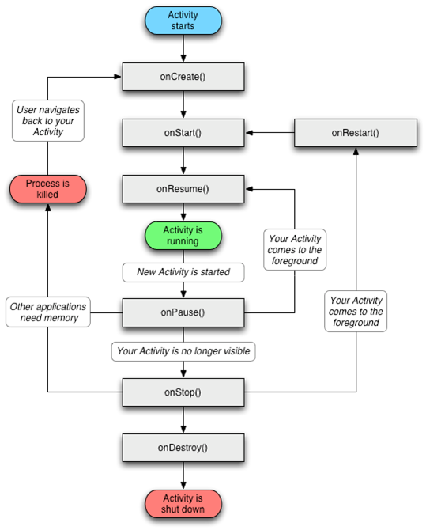

# Android 基础回顾总结 #
---------------1.0.0/2018.10.29

## Activity生命周期 ##

### 1. 常用生命周期 ###

    
   

- onCreate 
表示activity正在创建。这个方法中可以做一些初始化操作（setContentView加载布局，初始化数据等），但是不能太耗时。否则造成体验影响，或anr
- onStart
activity正在被启动，初始化完成，但是还在后头我们看不见。
- onRestart
    当activity有onStop的不可见状态，到可见时，则被调用。
- onResume 
已经可见在前台了。
- onPause
 一般当前页面被遮挡了（但是没有完全遮挡），则会回调此周期
- onStop
    当前界面被完全遮挡时，
- onDestroy
    界面被正常销毁
- onNewIntent
    一般和设计模式有关， singalTask ，singalTop
- onSaveInstanceState
    非正常关闭时，则会调用此状态
- onRestoreInstanceState
    非正常关闭后，再重新调创建时，则会调用此状态。

    > 生命周期可以做一些初始化（onCreate、onStart、onResume）和资源释放（onPause、onStop、onDestroy）的操作。但是都不能做太耗时的操作，否则会影响体验（界面的显示卡顿，或影响下一个页面的加载）。

### 2. 不同情况下的生命周期 ###

- 场景1： ActivityA 跳转到ActivityB， 然后ActivityB按Back键返回到ActivityA
  
    - ActivityA 跳转到ActivityB:
       A-onPause->B-onCreate->B-onStart->B-onResume->A-onSaveInstanceState->A-onStop
    - ActivityB 返回到 AcitivityA
    B-onPause->A-onRestart->A-onStart->A-onResume->B-onStop->B-onDestroy

- 场景:2： ActivityA 跳转到ActivityB (startActivityForResult)， 然后ActivityB setResult并finish返回到ActivityA
   - ActivityA 跳转到ActivityB:
       A-onPause->B-onCreate->B-onStart->B-onResume->A-onSaveInstanceState->A-onStop
   - ActivityB 返回到 AcitivityA
    B-onPause->A-onActivityResult->A-onRestart->A-onStart->A-onResume->B-onStop->B-onDestroy
- 场景3：ActivityA ->（跳转）ActivityB ->(跳转)ActivityA, A 启动模式为signalTask
    - ActivityA 跳转到ActivityB:
       A-onPause->B-onCreate->B-onStart->B-onResume->A-onSaveInstanceState->A-onStop
    - ActivityB 跳转到 AcitivityA
    B-onPause->A->onNewIntent->A-onRestart->A-onStart->A-onResume->B-onStop->B-onDestroy

- 场景4：ActivityA ->（跳转startActivityForResult ）ActivityB ->(跳转)ActivityA, A 启动模式为singleTask
    - ActivityA 跳转到ActivityB:
       A-onPause->B-onCreate->B-onStart->B-onResume->A-onSaveInstanceState->A-onStop
    - ActivityB 跳转到 AcitivityA
    B-onPause->A-onActivityResult->A->onNewIntent->A-onRestart->A-onStart->A-onResume->B-onStop->B-onDestroy
- 场景5：ActivityA ->（跳转）ActivityA , A 启动模式为singleTop
 - ActivityA 跳转到ActivityA:
   A-onPause->A->onNewIntent->A-onResume

##启动模式（LaunchMode） ##

### 1. 启动模式种类 ###
- standard
标准模式。
- singleTop
当activity栈的顶部是要启动的Activity 的实例，并且是当前模式，则不会重新创建新的activity，而是使用当前的activity。（场景，一些当前页面反复天跳转到当前页面的场景，如个人主页什么的）
- singleTask
当某个页面又要启动ActivityA时，如果栈中有ActivityA，并且模式是singleTask ，则会把ACtivityA之上的Activity清理出站，让ActivityA显示在栈顶。
- singleInstance
单独创建一个新栈维护当前的activity

### 2. 查看activity栈 ###

adb shell dumpsys activity activities 可以用来查看Activity Task栈的情况

### 3. singleInstance模式 ###

- ActivityA（standard）
- ActivityB (instance)
- ActivityC (SingleTop)

首先ActivityA 创建在栈A中, 接着 ActivityB 在新栈B中（B栈为当前栈）， 启动ActivityC 则又重新进入了栈A中（栈A为当前栈）。

此时点击back键，则是ActivityC 从A栈中出栈， 然后是ActivityC从栈A中出站，然后再是ActivityB从栈B中出栈。

## Activity 与Fragment 的onActivityResult 启动于回调传播 ##

#### 1. activity使用 onActivityResult ####
启动activity的时候使用startActivityForResult（intent，requestCode）；

#### 2. fragment 使用onActivityResult ####

- activty中单层Fragment情况。
    - 使用app包下面的Fragment。
        fragment 收到结果条件： 需要调用fragment中的startActivityForResult（intent，requestCode），而不是调用Activity 中的startActivityForResult。
        
        结果： fragment 中的onActivityForResult有回调，而 Activity中onActivityForResult无回调。
    
    - 使用support4 包中的Fragment 
        fragment 收到结果条件：  1）需要调用fragment中的startActivityForResult（intent，requestCode）2） Activity 中的onActivityForResult方法中必须调用super.onActivityForResult()，如果没有则只有Activity中有回调。
      
        结果： fragment 中的onActivityForResult有回调，Activity中onActivityForResult有回调，但是activity 中回调则requestCode 不正确。
    
    - 28 api 开始弃用了app包中的Fragment
- 多层Fragment 回掉，则需要主动的去通过Fragment调用onActivityForResult。

#### 3. 启动模式与onActivityResult ####

- ActivityA（包含FragmentA ），Fragment 中调用getActivity(). startActivityForResult（intent，requestCode）. ActivityB 启动模式为SignalTask， 则的onActivityResult 无回调。 
Fragment 中调用startActivityForResult 效果是一样的。
> 注意： ActivityA在点击按钮一跳转就会onActivityResult直接回掉，而不是等待在ActivityB返回后，再回调。

- 当ActivityA 启动模式为singleInstance  时，onActivity 也是无效的。 
>ActivityA在点击按钮一跳转就会onActivityResult直接回掉，而不是等待在ActivityB返回后，再回调（和上面一样）。

## Service ##

### 1.Service启动方式 ###
- startService
    
- bindService

### 2.生命周期 ###
### 3.Service通信 ###
    
- AIDL
- intent
- handler
- 
### 4.IntentService ###

## 自定义控件 ##
## 动画##
### 1.帧动画 ###
### 2.补间动画###
### 3.属性动画 ###
## 序列化 ##
### 1.序列化两种方式 ###
### 2.序列化的作用 ###

##事件分发流程##

### View，ViewGroup分发 ###

## View 绘制流程 ##

## Activity、Window、Windows、DecorView、 ViewRootImpl ##

## 进程间通信方式##

## Buidler机制##

## CrashHandler ##

## Multidex ##

多个dex 有可能需要的dex 没有在主dex中，造成找不到的问题。

## Activity 启动 ##
## APP 安装 ##
## android 虚拟机 ant 和dvm ##
## 进程、LMK ##
## 线程开发 ##
## 多进程开发 ##
## 基本算法 ##
## 加密各种原理 ##
### 1.RSA ###
### 2.AES ###
### 3 BASE64###
### 4.MD5 ###

## 网络 ##
### 1.socket、 sshSocket ###
### 2.HTTP HTTPS###
### 3. http请求的各种code ###
### 4.post get 的区别 ###

## 引用 ##

##性能优化##
### 1.布局优化 ###
### 2.绘制优化 ###
### 3.内存优化 ###
- 防止内存泄漏
- 减少内存开支
- bitmap 优化，高效加载，缓存策略，优化卡顿
### 4.响应速度优化 ###
- 耗时逻辑
- 资源加载耗时
- ANRlog查看
### 5.ListView 和Bitmap 优化 ###
### 6.线程优化 ###
### 7.数据结构，代码优化 ###
### 8.网络优化 ###
### 9.电量优化 ###

