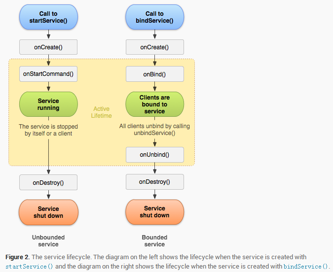
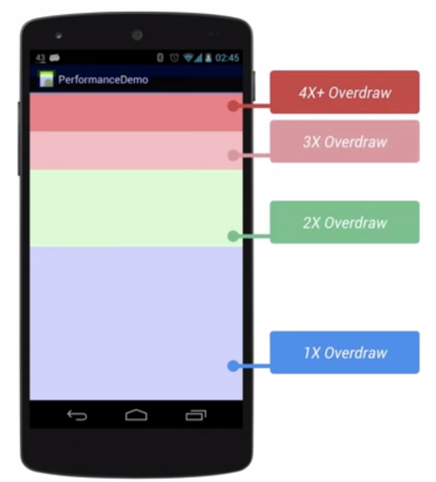

# Android 基础回顾总结 #
---------------1.0.0/2018.10.29

## Activity生命周期 ##

### 1. 常用生命周期 ###

    
   

- onCreate 
表示activity正在创建。这个方法中可以做一些初始化操作（setContentView加载布局，初始化数据等），但是不能太耗时。否则造成体验影响，或anr
- onStart
activity正在被启动，初始化完成，但是还在后头我们看不见。
- onRestart
    当activity有onStop的不可见状态，到可见时，则被调用。
- onResume 
已经可见在前台了。
- onPause
 一般当前页面被遮挡了（但是没有完全遮挡），则会回调此周期
- onStop
    当前界面被完全遮挡时，
- onDestroy
    界面被正常销毁
- onNewIntent
    一般和设计模式有关， singalTask ，singalTop
- onSaveInstanceState
    非正常关闭时，则会调用此状态
- onRestoreInstanceState
    非正常关闭后，再重新调创建时，则会调用此状态。

    > 生命周期可以做一些初始化（onCreate、onStart、onResume）和资源释放（onPause、onStop、onDestroy）的操作。但是都不能做太耗时的操作，否则会影响体验（界面的显示卡顿，或影响下一个页面的加载）。

### 2. 不同情况下的生命周期 ###

- 场景1： ActivityA 跳转到ActivityB， 然后ActivityB按Back键返回到ActivityA
  
    - ActivityA 跳转到ActivityB:
       A-onPause->B-onCreate->B-onStart->B-onResume->A-onSaveInstanceState->A-onStop
    - ActivityB 返回到 AcitivityA
    B-onPause->A-onRestart->A-onStart->A-onResume->B-onStop->B-onDestroy

- 场景:2： ActivityA 跳转到ActivityB (startActivityForResult)， 然后ActivityB setResult并finish返回到ActivityA
   - ActivityA 跳转到ActivityB:
       A-onPause->B-onCreate->B-onStart->B-onResume->A-onSaveInstanceState->A-onStop
   - ActivityB 返回到 AcitivityA
    B-onPause->A-onActivityResult->A-onRestart->A-onStart->A-onResume->B-onStop->B-onDestroy
- 场景3：ActivityA ->（跳转）ActivityB ->(跳转)ActivityA, A 启动模式为signalTask
    - ActivityA 跳转到ActivityB:
       A-onPause->B-onCreate->B-onStart->B-onResume->A-onSaveInstanceState->A-onStop
    - ActivityB 跳转到 AcitivityA
    B-onPause->A->onNewIntent->A-onRestart->A-onStart->A-onResume->B-onStop->B-onDestroy

- 场景4：ActivityA ->（跳转startActivityForResult ）ActivityB ->(跳转)ActivityA, A 启动模式为singleTask
    - ActivityA 跳转到ActivityB:
       A-onPause->B-onCreate->B-onStart->B-onResume->A-onSaveInstanceState->A-onStop
    - ActivityB 跳转到 AcitivityA
    B-onPause->A-onActivityResult->A->onNewIntent->A-onRestart->A-onStart->A-onResume->B-onStop->B-onDestroy
- 场景5：ActivityA ->（跳转）ActivityA , A 启动模式为singleTop
 - ActivityA 跳转到ActivityA:
   A-onPause->A->onNewIntent->A-onResume

##启动模式（LaunchMode） ##

### 1. 启动模式种类 ###
- standard
标准模式。
- singleTop
当activity栈的顶部是要启动的Activity 的实例，并且是当前模式，则不会重新创建新的activity，而是使用当前的activity。（场景，一些当前页面反复天跳转到当前页面的场景，如个人主页什么的）
- singleTask
当某个页面又要启动ActivityA时，如果栈中有ActivityA，并且模式是singleTask ，则会把ACtivityA之上的Activity清理出站，让ActivityA显示在栈顶。
- singleInstance
单独创建一个新栈维护当前的activity

### 2. 查看activity栈 ###

adb shell dumpsys activity activities 可以用来查看Activity Task栈的情况

### 3. singleInstance模式 ###

- ActivityA（standard）
- ActivityB (instance)
- ActivityC (SingleTop)

首先ActivityA 创建在栈A中, 接着 ActivityB 在新栈B中（B栈为当前栈）， 启动ActivityC 则又重新进入了栈A中（栈A为当前栈）。

此时点击back键，则是ActivityC 从A栈中出栈， 然后是ActivityC从栈A中出站，然后再是ActivityB从栈B中出栈。

## Activity 与Fragment 的onActivityResult 启动于回调传播 ##

#### 1. activity使用 onActivityResult ####
启动activity的时候使用startActivityForResult（intent，requestCode）；

#### 2. fragment 使用onActivityResult ####

- activty中单层Fragment情况。
    - 使用app包下面的Fragment。
        fragment 收到结果条件： 需要调用fragment中的startActivityForResult（intent，requestCode），而不是调用Activity 中的startActivityForResult。
        
        结果： fragment 中的onActivityForResult有回调，而 Activity中onActivityForResult无回调。
    
    - 使用support4 包中的Fragment 
        fragment 收到结果条件：  1）需要调用fragment中的startActivityForResult（intent，requestCode）2） Activity 中的onActivityForResult方法中必须调用super.onActivityForResult()，如果没有则只有Activity中有回调。
      
        结果： fragment 中的onActivityForResult有回调，Activity中onActivityForResult有回调，但是activity 中回调则requestCode 不正确。
    
    - 28 api 开始弃用了app包中的Fragment
- 多层Fragment 回掉，则需要主动的去通过Fragment调用onActivityForResult。

#### 3. 启动模式与onActivityResult ####

- ActivityA（包含FragmentA ），Fragment 中调用getActivity(). startActivityForResult（intent，requestCode）. ActivityB 启动模式为SignalTask， 则的onActivityResult 无回调。 
Fragment 中调用startActivityForResult 效果是一样的。
> 注意： ActivityA在点击按钮一跳转就会onActivityResult直接回掉，而不是等待在ActivityB返回后，再回调。

- 当ActivityA 启动模式为singleInstance  时，onActivity 也是无效的。 
>ActivityA在点击按钮一跳转就会onActivityResult直接回掉，而不是等待在ActivityB返回后，再回调（和上面一样）。

## Service ##

### 1.Service启动方式 ###
- startService
  通过其他组件启动service，可以独立在后台无限运行（版本不会回收，个别手机除外（小米，华为等））。需要自己调用stopSelf去停止，停止后然后被系统销毁。
- bindService
  依附于activity。当activity销毁之后，其也会自动停止，并销毁。bindService一般用于和Service进行数据交互。
两种方式可以混合使用。

### 2.生命周期 ###
   
### 3.Service通信 ###
- intent  
  轻量级数据传给Service 则可以使用startService。把数据放在intent 中，传给Service。 
  在Service 的 onStartCommand中处理信息。  
- Messager 
    底层实现是AIDL。是对AIDL实现的封装。
    使用方法是，
    - 在Service里，通过Messager（MessagerHandler）创建Messager 对象，然后通过       messager.getBinder() 方法，在onBinder 方法中返回Binder。MessagerHandler 是用于接收处理对象的。
    - 在client端： 在用于绑定Service的Connection 对象实现中的 onServiceConnected（ComponentName name， IBinder binder）中，通过取得binder对象，使用Messager的
    Messager（IBinder） 方法构造出Messager对象。然后就可以通过Messager对象send msg给Service了。消息会传到Service中的Messager的MessagerHandler 中的handlerMessage方法中处理。
    - 实现Service 向client 通信时，需要在client端通过Messager（MessagerHandler），然后把这个对象通过 有service传过来IBinder生存的Messager传到Service端，然后Service端就拥有了client端Messager 通道对象，通过send就可以向client传输信息了。    
    

- AIDL
	- 语法 
	没有修饰词， 参数有in out方向
	- AIDL声称的源码，看一下；stub 等 等 

### 4.IntentService ###

## 自定义控件 ##
## 动画##
### 1.帧动画 ###
### 2.补间动画###
### 3.属性动画 ###
## 序列化 ##

### 1. 序列化 和反序列化 ###

- 序列化： 将对象转化为可以传输和存储的过程（字节序列）。
- 反序列化：将序列化后的数据还原成对象的过程。
- 序列化和反序列化前后，虽然数据一直，但是对象不是同一个对象。

### 2.序列化两种方式 ###
- Serializable
一个空接口， 是java中带的。serailVersionUID 最好设定。理论上只有前后versionUID一致，才能反序列化成功. Seriazable 是把数据进行流操作，把数据持久化的过程，有io操作，效率相对于低。适合需要数据持久化相关的操作。比如存储，网络传输等可以使用这种序列化。

1、静态成员变量属于类，不属于对象，所以不会参与序列化的过程
2、用transient关键字编辑的成员变量不参与序列化的过程。
3、可以通过重写writeObject()和readObject()两个方法来重写系统默认的序列化和反序列化的过程。

- Parcelable
其是android所有的，主要用于binder的数据传输。序列化对象存储到了Parcel中。主要是在内存中使用，所以效率比较高。
1、序列化功能由writeToParcel来完成，最终是通过Parcel中的一些列write方法来完成的。
2、反序列化是由CREATOR来完成，其内部标明了如何创建序列化对象和数组，并通过Parcel的一些列read方法来完成反序列化过程。
3、内容描述功能由describeContents方法来完成，几乎在所有情况下这个方法都应该返回0，仅当前对象中存在文件描述符时，此方法返回1。

- 如果持久化操作，选择Seriazable。 效率比较低，因为进行了IO操作。如果仅内存中操作，使用Parcelable，效率相对较高。

##事件分发流程##

### View，ViewGroup分发 ###

## View 绘制流程 ##

## Activity、Window、Windows、DecorView、 ViewRootImpl ##

## 进程间通信方式##
- Socket
- 文件
- 管道
- localSocket
- AIDL（Binder）
- 广播，提供者等。

## Buidler机制##
原理是内存拷贝。比Socket效率高， binder只进行一次拷贝，socket进行两次拷贝。

 
 
服务启动的时候会在ServiceManager中进行注册。客户端首先通过ServiceManager 去查找对应的服务对象（实际为能查找底层Service的代理）。通过这个对象在JNI层找到对应的服务。通过找到的服务向内核态传输数据（即copy进去）并等待回复， 然后通过Binder 驱动 把数据copy给Service，完成后会回一个response。 真正的数据copy是在binder驱动里进行操作的。

## CrashHandler ##

## Multidex ##

多个dex 有可能需要的dex 没有在主dex中，造成找不到的问题。

## Activity 启动 ##
## APP 安装 ##
## android 虚拟机 ant 和dvm ##
## 进程、LMK ##
## 线程开发 ##
## 多进程开发 ##
## 基本算法 ##
## 加密各种原理 ##
### 1.RSA ###
### 2.AES ###
### 3 BASE64###
### 4.MD5 ###

## 网络 ##
### 1.socket、 sshSocket ###
### 2.HTTP HTTPS###
### 3.http请求的各种code ###
### 4.post get 的区别 ###

## 引用 ##
- 强引用
  指new 出来的对象等，对象只要有强引用在，则不会释放。
- 软饮用
 softRefrence。 对象有软引用时，当gc时，如果内存不够了，它才会被回收掉。
- 弱引用
  gc调用时就会被回收掉。 大的对象，占内存的时间长的。
- 虚引用
  一创建完立马就被回收掉。

##性能优化##
### 1.布局优化 ###

- 避免过度绘制 
view 第一次需要渲染的时候会产生一个对应的DisplayList(Layer).DisplayList交给GPU进行渲染。
当View渲染后，进行位置操作的等操作的时候只需要执行渲染指令。当View内容发生改变的时候，则需要重新创建DisplayList 然后重新渲染。创建DisplayList的过程就是绘制整个View的过程，效率取决于View的负责程度。

	描述的是屏幕上的某个像素在同一帧的时间内被绘制了多次。在多层次的UI结构里面，如果不可见的UI也在	做绘制的操作，就会导致某些像素区域被绘制了多次，浪费大量的CPU以及GPU资源。（可以通过开发者选	项，打开Show GPU Overdraw的选项，观察UI上的Overdraw情况）。

  

    蓝色、淡绿、淡红，深红代表了4种不同程度的Overdraw的情况，我们的目标就是尽量减少红Overdraw，看到更多的蓝色区域。

- 解决：

	- RelativeLayout LinearLayout
 		RelativeLayout 解决复杂的布局减少布局层级嵌套。 LinearLayout 效率比较高。简单的可使	用LinearLayout。
 
 		Android Device Monitor后，选中Hierarchy View 查看布局。
	- include、merge、ViewStub 使用
	include标签常用于将布局中的公共部分提取出来
	merge标签是作为include标签的一种辅助扩展来使用.结局include 引用后多一个布局嵌套的问题。
	viewstub是view的子类。他是一个轻量级View， 隐藏的，没有尺寸的View。能指向一个布局。
	- ConstaintLayout
	  支持包， 类似于ios拖拽。
	- 利用Android Lint工具寻求可能优化布局的层次
		- 一些Lint规则如下：
		- 1、使用组合控件： 包含了一个ImageView以及一个TextView控件的LinearLayout如果能够作为一个组合控件将会被更有效的处理。
		- 2、合并作为根节点的帧布局(Framelayout) ：如果一个帧布局时布局文件中的根节点，而且它没有背景图片或者padding等，更有效的方式是使用merge标签替换该Framelayout标签 。
		- 3、无用的叶子节点：通常来说如果一个布局控件没有子视图或者背景图片，那么该布局控件时可以被移除(由于它处于 invisible状态)。
		- 4、无用的父节点 ：如果一个父视图即有子视图，但没有兄弟视图节点，该视图不是ScrollView控件或者根节点，并且它没有背景图片，也是可以被移除的，移除之后，该父视图的所有子视图都直接迁移至之前父视图的布局层次。同样能够使解析布局以及布局层次更有效。
		- 5、过深的布局层次：内嵌过多的布局总是低效率地。考虑使用一些扁平的布局控件，例如 RelativeLayout、GridLayout ，来改善布局过程。默认最大的布局深度为10 。
### 2.绘制优化 ###
### 3.内存优化 ###
- 防止内存泄漏
- 减少内存开支
- bitmap 优化，高效加载，缓存策略，优化卡顿
### 4.响应速度优化 ###
- 耗时逻辑
- 资源加载耗时
- ANRlog查看
### 5.ListView 和Bitmap 优化 ###
### 6.线程优化 ###
### 7.数据结构，代码优化 ###
### 8.网络优化 ###
### 9.电量优化 ###

